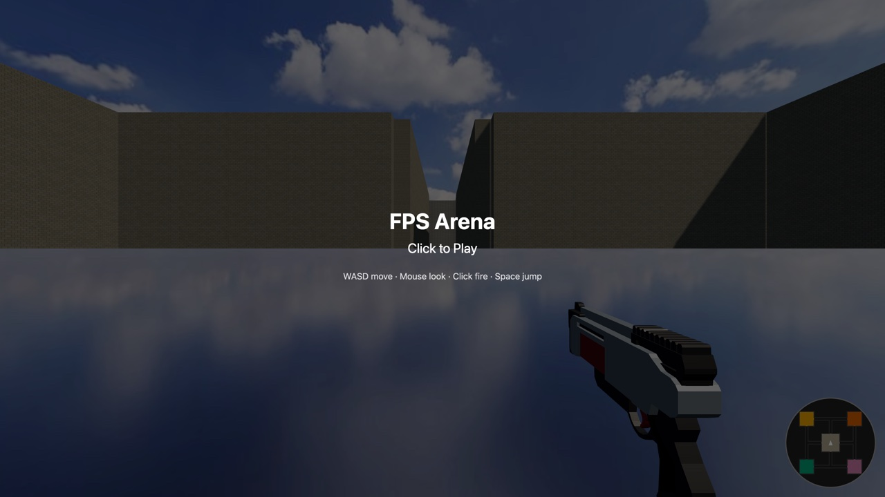
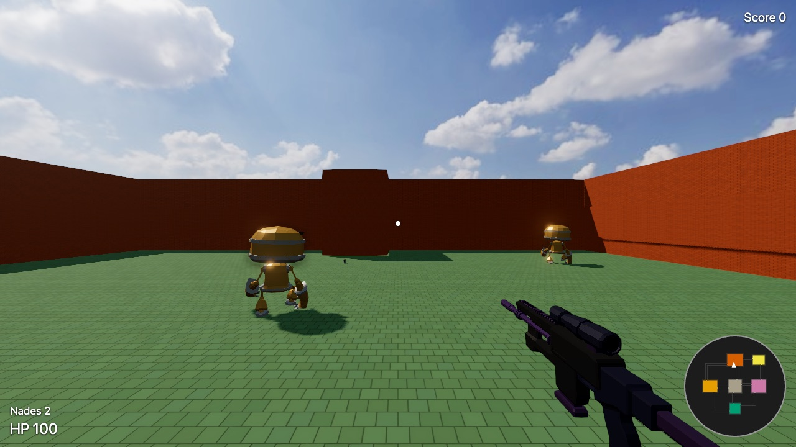
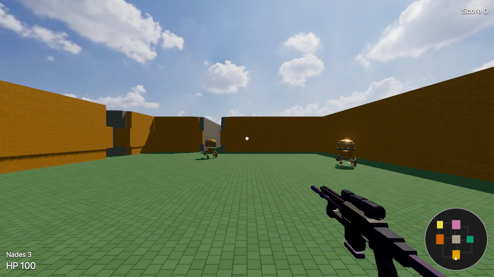

# FPS Arena

A browser-based 3D shooter: hunt AI bots through an asymmetric,
districts-and-corridors map in deathmatch, built with Three.js and Rapier
physics. Bots patrol, chase, search a last-seen position when they lose
sight of you, and retreat toward a doorway when hurt. They only acquire
what is inside a forward cone, so flanking is worth doing — though shooting
one alerts it, and it will turn on you. Each district — a
tight chamber warren, an open long-sightline yard, a pillared hall, a
cover-block maze, a scattered-cover bazaar — is identifiable by its
structure alone, with its own accent color as a secondary cue, echoed on a
player-only rotating minimap, so you always know where you are without
giving away anything about the bots. A killfeed under the score narrates
every kill as it happens — yours in gold, your death in red — without
ever revealing a position.

The machine gun is everyone's default, infinite weapon from the moment
they spawn — player and bots alike, no pickup required. Grenades spawn as
a pickup in each outlying district and respawn on a timer, so holding
those matters.

Nobody appears out of thin air and nobody vanishes. Arrivals are flown in:
a drone releases them overhead and peels away, and the fall is real
simulation, so a descending bot can be shot on the way down and cannot
shoot back until it lands. The dead stay dead in place — a body is left
where it fell, for the rest of the match, so a room tells you what happened
in it. Bodies are scenery: shots and sightlines pass straight through
them.

Every shot reads as one: a muzzle flash, a tracer down its path, a spark
where it lands, and a bullet hole with a scorch ring that stays on the
wall. A grenade goes off as a fireball and lights the room around it.
Those four effect shapes are soft radial gradients, generated into pixel
data at load rather than shipped as images — no download, no attribution,
and their shape is unit-testable, which matters because nothing else about
a render can be. On top of that the arena runs a light post-processing
pass (bloom, ambient occlusion, a skybox) over real sourced models and
audio for the weapons.

## Screenshots

<table>
<tr>
<td width="50%"></td>
<td width="50%"></td>
</tr>
<tr>
<td width="100%" colspan="2"></td>
</tr>
</table>

## Run locally

```bash
npm install
npm run dev
```

Open the printed `localhost` URL, click "Click to Play", and go.

- **Move:** WASD
- **Look:** Mouse
- **Fire:** Click and hold (the machine gun sprays continuously while held — it's infinite and it's the only weapon, from the first spawn)
- **Throw grenade:** G (grenades are picked up from the outlying districts; area damage hits everyone in blast radius, including the thrower, and is blocked by walls)
- **Jump:** Space
- **Pause / settings:** Escape

Adding `?debug` to the URL turns on an fps readout and a set of
`window.__debug*` hooks that read and drive the running game — entity
state, bot phases, the shadow rig's own numbers, and direct fire/throw/
teleport calls that do not need pointer lock. They exist so the parts of
this game a unit test cannot see can still be checked by something other
than eye: several of the render bugs this project has fixed looked
identical from the outside and had unrelated causes.

### Graphics

Escape opens the pause screen, which carries the one graphics setting worth
exposing: **Shadows: High / Standard**. The shadow map is stretched over the
whole arena, so High (4096) is what keeps shadow edges crisp at this map's
size, and Standard (2048) halves that resolution for machines where the
larger map costs frames — integrated graphics, mostly. High is the default
and a modern discrete GPU will not notice it. The choice applies immediately
and is remembered between sessions.

## Build for deployment

```bash
npm run build
```

This produces a static site in `dist/` — no server-side code, no
database. `dist/` is a complete, self-contained website; any static host
works. Asset paths are relative, so the same build works whether it's
served from a domain root or a subdirectory (e.g. a GitHub Pages project
page).

## Deploy

Pick any static host and upload the contents of `dist/`. A few options:

- **Netlify Drop** — go to https://app.netlify.com/drop and drag the
  `dist/` folder in. Gives you a shareable URL immediately, no account
  required for a one-off deploy.
- **Vercel** — `npx vercel --prod dist` (requires a free Vercel account;
  the CLI will prompt you to log in).
- **GitHub Pages** — push this repo to GitHub, then either enable Pages
  from a `dist/` branch/folder, or use `npx gh-pages -d dist` (requires
  the `gh-pages` package: `npm install --save-dev gh-pages`).
- **itch.io** — zip the *contents* of `dist/` (not the folder itself,
  `index.html` must be at the zip root) and upload as an HTML5 project.

## Tests

```bash
npm test          # unit and integration, headless, ~3s
npm run test:visual   # drives the real game in a browser and measures pixels
```

`npm test` is the fast, hermetic suite and stays that way. The visual layer is
separate because it needs a browser and a few seconds of scene boot:

```bash
npx playwright install chromium   # once
npm run test:visual
```

It exists because this project could see its simulation in complete detail
and could not see its output at all — and that is where the defects
collected. Shadow seams along every wall base, bullet marks rendering as hard
black squares, a district that silently stopped casting shadows: found by a
person looking at the screen, invisible to every one of the 510 unit tests.

Every check is a **numeric property compared against another measurement from
the same frame** — the seam against the floor beside it, shadowed ground
against lit ground — so there are no stored screenshots to rot and no
dependence on which GPU ran it. Each one is also verified to fail against the
code that shipped the original defect; a guard that cannot fail is worse than
no guard, and the first draft of the seam check drew its reference from
inside the seam and passed cleanly against the exact bug it was written for.

If a defect can be caught by computing over source data, it belongs in `npm
test` instead — z-fighting between coloured walls is a visual symptom whose
cause is two boxes sharing a volume, so it is asserted in
`test/arena/layout.test.js`, not here.

## Documentation

- `docs/plans/` — the design plans this project was built from, one per
  feature pass (arena, combat feel, minimap, armory loop, killfeed, visual
  fidelity, asymmetric districts): product requirements, key technical
  decisions, and the implementation unit breakdown.
- `docs/solutions/` — documented bugs and their root causes, organized by
  category with searchable frontmatter. Worth checking before touching
  bot AI or simulation code.
- `docs/residual-review-findings/` — findings from code review that were
  read, judged, and deliberately not acted on, with the reasoning. Kept so
  the same ground is not re-argued from scratch.
- `CONCEPTS.md` — shared vocabulary for this codebase's domain (Command,
  Entity, Bot, Bot Phase).

## Credits

Third-party assets and their licenses are listed in `CREDITS.md`.
