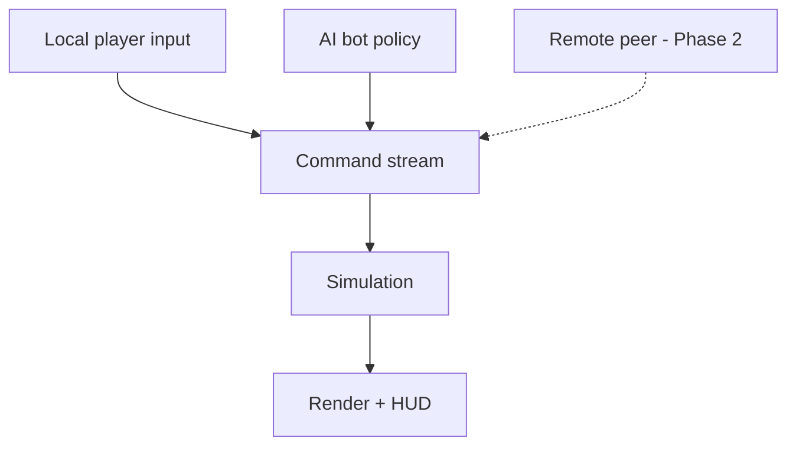
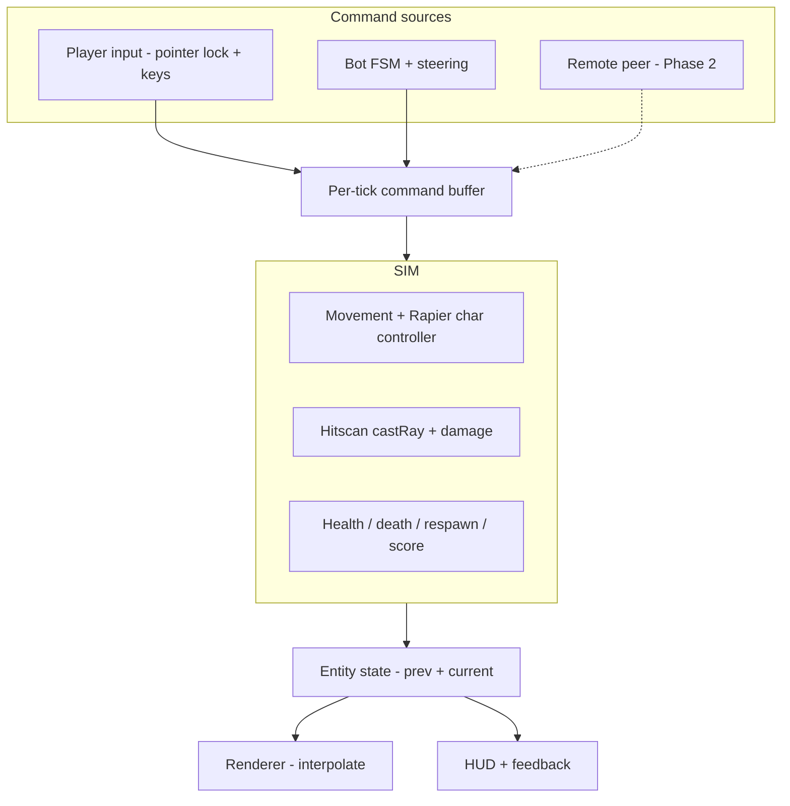

# Web FPS Arena - Plan

## Goal Capsule

- **Objective:** Build a browser-based 3D arena first-person shooter where a single player fights AI bots in deathmatch. This plan owns the single-player v1; real-time multiplayer is a named Phase 2, not active scope.
- **Product authority:** Learning/portfolio project that is also fun to play with friends. Two goals steer every tradeoff: learn 3D and game-dev concepts, and produce a portfolio-credible artifact. "Play with friends" is honored by architecting v1 so multiplayer is a later swap.
- **Authority hierarchy:** Product Contract requirements (R-IDs) win on product behavior; Key Technical Decisions (KTDs) win on implementation mechanism within their cited R constraints; a unit's Approach overrides neither. An explicit user instruction overrides all.
- **Execution profile:** Deep plan, ~10 units across 5 phases. Solo developer, comfortable with JavaScript, new to 3D. Phase 1 is spike-gated: a launchable skeleton and platform-API spikes must validate before gameplay units begin.
- **Stop conditions:** Stop and surface a blocker if a Phase 1 spike (U2) cannot validate a core platform API, if a change would contradict a session-settled decision or the Product Contract scope, or if the ~60fps target cannot be met at the v1 bot count without a scope change.
- **Tail ownership:** Standalone build on `main`; no PR-review pipeline required for a solo project. Deployment to a shareable static link is U10.
- **Open blockers:** None. Deferred-to-planning questions (physics library, weapon model, bot approach, build tooling) are resolved as KTDs below; remaining deferrals are non-blocking (see Outstanding Questions).

## Product Contract

### Summary

A single-player 3D arena FPS for the browser: move, shoot AI bots, take damage, respawn, and score in a deathmatch. Low-poly stylized visuals from free asset packs. Built on Three.js plus a physics library, with a deliberate input→command→simulation seam that removes one class of Phase-2 rework (control-source coupling); prediction, reconciliation, and server authority remain net-new multiplayer work.

### Problem Frame

The author is comfortable with JavaScript but new to 3D, and wants a project that teaches 3D and game-dev concepts (render loop, vectors, collisions, game state) without dropping to raw WebGL or shader plumbing. The result should be something they are proud to show and can send to friends to play. A full real-time multiplayer shooter is where most of that fun lives, but netcode is the hardest part of an FPS and would dominate the effort before anything is playable. Starting single-player against bots gets to a good-feeling core fast and de-risks the hard part — provided v1 is built so the eventual multiplayer work is additive.

### Key Decisions

- **Three.js + a physics library, not a batteries-included or editor-first engine.** Best fit for a JS developer who wants the 3D/game concepts while letting a library handle WebGL; deepest tutorial ecosystem; strongest "I built this" portfolio signal. (session-settled: user-directed — chosen over Babylon.js and editor-first engines: best learning + portfolio value for a JS dev.) Governs R11.
- **Single-player-first (arena vs bots) over multiplayer-from-day-one.** De-risks netcode and reaches a playable, good-feeling core quickly; multiplayer is Phase 2. (session-settled: user-directed — chosen over MP-in-v1: faster to something playable, lower risk.)
- **Bots are stand-in players behind an input→command→simulation seam.** Local player, AI bot, and future remote peer all produce the same command stream feeding one simulation, so the arena, movement, hit detection, and respawn built for v1 carry directly into multiplayer. The seam removes control-source coupling — the main structural rework multiplayer would otherwise force — but does not by itself deliver multiplayer: prediction, reconciliation, lag compensation, and server authority remain net-new Phase-2 work. (session-settled: user-directed — chosen over simplest-possible v1: modest cost now removes the control-source rework that would otherwise dominate the multiplayer transition.) Governs R10, R11.
- **Low-poly stylized art from free asset packs, not custom or realistic art.** Keeps effort on gameplay and code while staying portfolio-credible. Governs R9.

The seam behind the stand-in-player decision, shown as the fan-in it creates:

### Actors

- A1. Player — the human, controlling one avatar via mouse and keyboard.
- A2. Bot — an AI-controlled opponent avatar; stands in for a networked player.
- A3. Remote peer — a networked player. Out of scope for v1; named so the stand-in-player seam (see Key Decisions) and R10 account for it.

### Requirements

**Core gameplay**

- R1. The player and bots fight in a shared arena; eliminating an opponent scores a point for the victor.
- R2. The player fires a weapon; a hit on a bot reduces that bot's health.
- R3. Any entity whose health reaches zero dies and respawns after a short delay at a spawn point.
- R4. The match shows a running score and ends on a defined condition (score target or timer); the exact condition is deferred to planning.

**Movement & controls**

- R5. First-person movement: WASD to move, mouse-look via pointer lock, and jump; movement collides with arena geometry.

**Bots / AI**

- R6. Bots navigate the arena, pursue and engage the player, and shoot back.
- R7. Bot difficulty is tunable enough to make solo play fun — challenging but not perfectly accurate.

**Arena & presentation**

- R8. A single enclosed arena with cover geometry and multiple spawn points.
- R9. Low-poly stylized visuals from free asset packs, including player/bot avatars, a first-person weapon view, and a minimal HUD (health, score, crosshair), plus player-facing feedback for taking damage (hit indicator), the death moment, and a visible respawn countdown during the respawn delay.

**Architecture (multiplayer-readiness)**

- R10. Entity control flows through a single input→command→simulation seam. In v1 the local player and AI bot emit the same command shape consumed by one simulation. The seam is designed so a future remote peer can emit the same shape, but the remote-peer command contract itself (timestamps, input sequencing, and anything netcode requires) is deferred to Phase 2.
- R11. The simulation is separable from rendering and input so it can later run authoritatively for multiplayer.

**Deployment**

- R12. The game runs in a modern desktop browser and is deployable as a shareable static link.

**Game shell & states**

- R13. The game presents states beyond the combat loop: a start screen, the in-match combat loop, and a match-end results screen that shows the final score and offers a way to play again. Play-again restarts a match (reset scores and spawns); this is distinct from in-match respawn, which continues arena state per AE2.
- R14. Pointer lock engages on an explicit click-to-play gesture (on the start screen or a resume overlay) and releases on Esc; releasing surfaces a pause/menu overlay, and a re-engage gesture returns to combat. The browser reserves Esc for releasing the lock, so any pause affordance builds on that release rather than competing with it.

### Key Flows

- F1. Core combat loop
  - **Trigger:** Match starts; player and bots spawn.
  - **Actors:** A1, A2
  - **Steps:** Entities spawn at spawn points → player moves and aims → player and bots exchange fire → hits reduce health → an entity dies, the victor scores → the dead entity respawns after a delay → continues until the match-end condition.
  - **Covers:** R1, R3, R5, R6, R8
- F2. Shot resolution
  - **Trigger:** Player or bot fires.
  - **Actors:** A1, A2
  - **Steps:** Fire command enters the simulation → simulation resolves the shot against target geometry/entities → on hit, applies damage and feedback → if health hits zero, triggers death and scoring.
  - **Covers:** R2, R3, R10
- F3. Match lifecycle
  - **Trigger:** The player loads the game in the browser.
  - **Actors:** A1
  - **Steps:** Start screen (a click engages pointer lock) → in-match combat loop (F1) → match-end condition met → results screen shows final score → player chooses play again (restart) or return to start.
  - **Covers:** R4, R13, R14

### Acceptance Examples

- AE1. **Covers R2, R3.** Given a bot at full health, When the player lands enough hits to bring it to zero health, Then the bot dies, the player's score increases by one, and the bot respawns at a spawn point after the delay.
- AE2. **Covers R3.** Given the player is killed by a bot, When the respawn delay elapses, Then the player respawns at a spawn point with full health and the arena state continues (no full reset).
- AE3. **Covers R5.** Given the player holds a movement key toward a wall, When the avatar reaches the wall, Then movement stops at the surface rather than passing through.
- AE4. **Covers R10.** Given an AI bot and (later) a remote peer, When each issues a "fire" action, Then both produce the same command shape and the simulation resolves them identically.

### Success Criteria

- Movement and shooting feel responsive and good — the portfolio-quality bar for the core loop. Because "feels good" is subjective, it is judged against observable proxies: the responsiveness of a fast classic arena shooter (Quake/Doom-family) as the reference, an input-to-render aim-latency budget of ≤ ~30 ms, and a lightweight playtest gate (3 of 3 first-time testers play more than 5 minutes unprompted).
- Fighting crude "dumb bots" that merely move and shoot back is already fun — this minimal bar is validated early, before investing in navigation or cover AI.
- Sustains ~60fps in a modern desktop browser during normal arena combat, measured at the v1 target bot count (set in planning) rather than a single bot.
- The full deathmatch loop works end to end: spawn, kill, score, respawn, match end.
- Deployable as a link the author can send to a friend to try.
- Visuals read as intentional and clean — portfolio-credible, not placeholder-looking.

### Scope Boundaries

**Deferred for later**

- Real-time multiplayer and netcode — the explicit Phase 2.
- Accounts, persistence, leaderboards, matchmaking.
- Multiple maps or campaign/level content — v1 is one arena.
- Audio design — a nice-to-have, not part of the v1 core.
- Mobile and touch controls.

**Outside this product's identity (for now)**

- Anti-cheat and server-authoritative competitive fairness — not relevant until multiplayer.
- Monetization.

### Dependencies / Assumptions

- Target is desktop with mouse and keyboard only; pointer-lock aiming is assumed.
- Animated humanoid bot/player models are among the harder tasks for someone new to 3D, so the first playable build may use simple placeholder geometry, with asset-pack models swapped in afterward — "low-poly stylized" is the v1 destination, not necessarily the first commit.
- Chosen free asset packs carry licenses compatible with a public portfolio piece.
- Bot behavior is the primary risk to the "fun solo" payoff — bot AI is the hardest FPS subsystem and its approach is deferred to planning. Plan around proving the minimal "dumb bots are fun" bar before scaling AI investment, so a bad-feeling result surfaces cheaply.

### Outstanding Questions

**Resolved during planning** (now Key Technical Decisions in the Planning Contract): physics library (KTD1), weapon resolution model (KTD3), bot AI approach (KTD4), build tooling and bundler (KTD5), simulation architecture (KTD2).

**Deferred to implementation** (non-blocking)

- Match-end condition: default is first-to-N kills; a round timer is an easy follow-up (see KTD7). Exact N tuned during playtest.
- Specific asset files within the chosen packs (Kenney / Quaternius) and the exact weapon/avatar selection — chosen during U9 asset integration.
- Static hosting target (Netlify / Vercel / GitHub Pages / itch.io) — chosen at U10; the `base` config is the only host-dependent decision.

---

## Planning Contract

**Product Contract preservation:** unchanged — all R/A/F/AE IDs and product scope are preserved. Deferred-to-planning questions are resolved as KTDs below.

### Key Technical Decisions

- KTD1. **Physics and character controller: Rapier (`@dimforge/rapier3d-compat`).** It is the best-fit, functional choice: the browser physics library with a first-class kinematic character controller (move-and-slide, autostep, slope limit, ground snap) and the densest Three.js learning material; cannon-es and ammo.js are unmaintained, and Jolt is heavier for a first 3D project. The `rapier.js` repo was archived July 2026 as a monorepo consolidation — npm still publishes, so pin the version (`@dimforge/rapier3d-compat` 0.19.x) and confirm resolution in the U2 spike. The `-compat` build embeds its WASM as base64, so no Vite WASM plugin is needed, but init is async (`await RAPIER.init()`) and the game loop must not start before it resolves. The controller resolves collisions only — a separate module owns velocity, gravity, and jump. Governs R5. (session-settled: user-approved — chosen over cannon-es / ammo.js / Jolt: only maintained option with a built-in character controller.)
- KTD2. **Simulation architecture: fixed-timestep loop + per-tick command buffer + a pure, Three.js-free simulation module; no ECS.** Each frame accumulates real time and steps the sim in constant `DT` (1/60), clamping frame time to avoid the spiral of death. The renderer interpolates *other* entities between the two most recent sim states and never mutates sim state, but the local player's camera and aim render from the latest sim state (no interpolation lag) so first-person aiming stays responsive. Every entity is driven by one `Command` shape (`{tick, moveX, moveZ, yaw, pitch, buttons}`) read from the buffer, so local player, bot, and future remote peer are interchangeable command sources. Continuous inputs (movement, look) apply on every sub-tick, but edge-triggered buttons (fire) are latched and consumed once per input event so shot count is framerate-independent no matter how many sim steps a frame runs. A handful of entities do not justify an ECS; the three seams (input→command, command→sim, sim→render) are what earn "netcode-ready." Cites R10, R11. (session-settled: user-approved — plain entities over an ECS: overkill for a handful of entities.)
- KTD3. **Weapons: hitscan, resolved inside the simulation step via Rapier `castRay`.** Instant raycast against the sim's collider world on the fire button in a Command. Crisp feel, cheapest to build, and lag-compensatable later; a projectile weapon can be added in Phase 2 without reshaping the command. Resolving inside the sim (not the render/input layer) is what keeps it lag-compensatable. Governs R2; realizes F2. (session-settled: user-approved — hitscan over projectile: crisp feel, simplest, lag-compensatable later.)
- KTD4. **Bot AI: finite state machine (Idle/Patrol → Chase → Attack → Retreat) + steering, no navmesh.** Sensing is distance plus a line-of-sight raycast against the sim world; the bot emits the same `Command` shape as the player. Difficulty is tuned via aim spread and reaction delay, not smarter pathing. A navmesh is a scoped later upgrade only if the arena becomes non-convex and bots visibly stick. Governs R6, R7; realizes A2, AE4. (session-settled: user-approved — FSM + steering over navmesh: sufficient for a convex arena, difficulty tunable without pathing.)
- KTD5. **Build and deploy: Vite 6 + npm, static build to a static host.** `-compat` Rapier avoids WASM plugins; `vite build` emits a static `dist/` deployable to any static host. The only host-dependent setting is `base` in `vite.config.js` (root vs project path). Governs R12.
- KTD6. **Assets: Kenney (CC0) for arena/props/weapon view; Quaternius (CC0/CC-BY) rigged GLTF for animated enemies.** Quaternius characters ship baked animation clips, so `GLTFLoader` → `AnimationMixer` works without rigging or retargeting — this removes the animated-enemy ramp. Build with placeholder capsule/box geometry first; swap models in once the core loop plays (U9). Use `SkeletonUtils.clone()` for reused skinned models. Governs R9.
- KTD7. **Match end: first-to-N kills (default), timer as a follow-up.** A kill-target end condition reuses the score already tracked for R1 and needs no clock; N is tuned in playtest. A round timer is an easy later addition. Governs R4.
- KTD8. **Test seam: unit-test the pure simulation module headlessly (Vitest); verify rendering, input, and feel in the browser.** Because the sim module is Three.js-free (KTD2), all behavioral logic — movement resolution, hitscan, health/death/respawn, scoring, command parity, fixed-step determinism — is unit-testable without a UI or GPU. This satisfies the constitution's "if it can break visibly, it must be testable without UI." Governs the Verification Contract.

### High-Level Technical Design

The runtime is one fixed-step simulation fed by interchangeable command sources and read by a decoupled renderer. The simulation module imports nothing from Three.js.

Runtime loop each animation frame: accumulate clamped real time; while `accumulator >= DT`, gather commands (edge-triggered buttons latched once per input event) and `step(commands, DT)` (which advances the Rapier world, resolves hitscans, and updates health/score/respawn); then render other entities interpolated by `accumulator / DT` while drawing the local player's camera and aim at the latest sim state. Startup is async: `await RAPIER.init()` and asset preload (with a load-failure fallback, U9) gate the first frame.

### Assumptions

- Standard Rapier is only locally deterministic; cross-machine determinism needs the separate `-deterministic` build. Therefore Phase-2 multiplayer is assumed to be **server-authoritative state sync**, not deterministic lockstep. This does not change v1 but shapes what the seam must preserve.
- v1 targets ~4 active bots; the ~60fps criterion is measured at that count. If it cannot be met, reduce bot count or simplify AI rather than dropping the target.
- Test runner is Vitest (pairs with Vite); the pure sim module needs no DOM/GPU to test.
- Desktop + mouse/keyboard only; WebGL renderer (not WebGPU) — sufficient for a low-poly arena.
- Phase-2 reconciliation would need a per-tick state history plus a snapshot/restore path for the Rapier world; the v1 prev+current model does not provide that. If per-correction Rapier restore proves impractical on `-compat`, the fallback is server-authoritative sync without client rollback. This is unvalidated Phase-2 risk, not v1 work, but it bounds how much the seam actually "carries directly" into multiplayer.

---

## Implementation Units

Units are grouped into five phases and dependency-ordered. Phase 1 is spike-gated per the project constitution: the skeleton must launch and the platform APIs must validate before gameplay begins.

### Unit Index

| U-ID | Title | Key files | Depends on |
|---|---|---|---|
| U1 | Launchable skeleton + render loop | `package.json`, `vite.config.js`, `index.html`, `src/main.js`, `src/render/` | — |
| U2 | Platform-API spikes (gate) | `src/spikes/` | U1 |
| U3 | Simulation core (loop + command seam) | `src/sim/` | U2 |
| U4 | Arena, spawns + player movement | `src/sim/`, `src/arena/`, `src/input/` | U3 |
| U5 | Combat: hitscan, health, respawn, score | `src/sim/` | U4 |
| U6 | Minimal bots (fun gate) | `src/sim/bot/basic.js` | U5 |
| U11 | Bot AI: FSM, steering, difficulty | `src/sim/bot/` | U6 |
| U7 | HUD + damage/death feedback + weapon view | `src/ui/`, `src/render/` | U5 |
| U8 | Game shell/states + pointer-lock lifecycle | `src/shell/` | U4, U7 |
| U9 | Asset integration (placeholder → models) | `public/assets/`, `src/render/` | U6, U8 |
| U10 | Static build + deploy | `vite.config.js`, host config | U8 |

### Phase 1 — Skeleton and spikes

### U1. Launchable skeleton and render loop
- **Goal:** A Vite + Three.js app that boots to one lit scene (ground plane + a box) and holds ~60fps, with click-to-play engaging pointer lock and Esc releasing it.
- **Requirements:** Advances R12; establishes the render half of R5.
- **Dependencies:** none.
- **Files:** `package.json`, `vite.config.js`, `index.html`, `src/main.js`, `src/render/scene.js`, `src/render/loop.js`, `test/smoke.test.js`.
- **Approach:** Three.js r185 via npm; `WebGLRenderer`; a `requestAnimationFrame` loop (fixed-step accumulator lands in U3). Use the PointerLockControls addon for the lock/unlock lifecycle and raw pointer deltas only — its built-in camera rotation is not used; camera orientation is derived from sim state (U4). A click-to-play overlay calls `controls.lock()`; the full lock lifecycle lands in U8. Validates build, module layout, and the render pipeline before any logic.
- **Patterns to follow:** Three.js official examples for renderer/scene/camera setup and PointerLockControls.
- **Execution note:** This is the launchable skeleton the constitution requires; prefer runtime smoke verification over unit coverage.
- **Test scenarios:**
  - Test expectation: smoke only — `npm run build` succeeds and `npm run dev` boots to a rendered frame. No behavioral logic yet.
- **Verification:** App launches, renders the scene, holds ~60fps (stats overlay), pointer lock engages on click and releases on Esc.

### U2. Platform-API spikes (validation gate)
- **Goal:** Prove every platform API the plan depends on before committing gameplay code.
- **Requirements:** De-risks KTD1, KTD2, KTD5, KTD6.
- **Dependencies:** U1.
- **Files:** `src/spikes/` (throwaway, removed or folded after validation).
- **Approach:** Five targeted spikes, each pass/fail: (1) `await RAPIER.init()` resolves from `-compat` under Vite with no WASM plugin; (2) `createCharacterController` move-and-slide works against a static collider (walk into a wall, climb a step); (3) a Quaternius GLTF loads and one animation clip plays via `AnimationMixer`; (4) `vite build` output loads and runs from a placeholder `base` (the host-specific `base` is verified at U10, where the host is chosen); (5) a feel spike — sample mouse-look and render the local camera at the latest sim state, and confirm input-to-render aim latency meets the budget (~30 ms) before the whole pipeline is built on the seam. If any spike fails, stop and surface it (Goal Capsule stop condition) rather than planning around an unvalidated API.
- **Execution note:** Spike before specifying platform APIs; discard or fold the spike code once each API is validated — do not leave spike scaffolding in the tree.
- **Test scenarios:**
  - Test expectation: none — spikes are manual validation gates, not shipped behavior. Record pass/fail for each of the five.
- **Verification:** All five spikes observably pass; findings noted; spike code removed or folded into real modules.

### Phase 2 — Simulation seam and movement

### U3. Simulation core: fixed-timestep loop and command seam
- **Goal:** A pure, Three.js-free simulation module that advances in fixed `DT` from a per-tick command buffer.
- **Requirements:** R10, R11; KTD2.
- **Dependencies:** U2.
- **Files:** `src/sim/index.js`, `src/sim/command.js`, `src/sim/world.js`, `src/sim/loop.js`, `test/sim/loop.test.js`, `test/sim/command.test.js`.
- **Approach:**
  1. Define the `Command` shape and a buffer keyed by entity/tick.
  2. Implement the accumulator loop: clamp frame time, step in constant `DT`, expose `alpha` for render interpolation.
  3. `step(commands, DT)` is the only mutation entry point; the module imports nothing from Three.js.
  4. Wire the renderer (U1 loop) to read interpolated `prev`/`current` state — read-only.
  5. Exposed per-entity state carries position, orientation, health, a dead flag, and a small animation hint (idle / moving / firing / dead), so the renderer picks clips (U9) without importing sim internals.
- **Patterns to follow:** Gaffer "Fix Your Timestep!" accumulator; Unity Netcode command-stream discipline (read input from the buffer, never directly).
- **Execution note:** Build the seam test-first — the module's purity is the whole point and is cheap to lock in with unit tests.
- **Test scenarios:**
  - Given identical command sequences, When the sim steps N times, Then resulting state is identical (fixed-step determinism, single machine).
  - Given a long frame delta, When the loop runs, Then steps are clamped (no spiral of death).
  - Given two sim states, When rendered with `alpha`, Then interpolated transforms fall between them.
  - Given the sim module, Then it has no import from `three` (guard test).
- **Verification:** Sim advances deterministically from commands; renderer only reads state; unit tests pass headlessly.

### U4. Arena, spawns, and player movement
- **Goal:** A player moves in first person through an enclosed arena with collision, driven by commands.
- **Requirements:** R5, R8, R10; KTD1.
- **Dependencies:** U3.
- **Files:** `src/input/sampler.js`, `src/sim/movement.js`, `src/arena/arena.js`, `src/arena/spawns.js`, `test/sim/movement.test.js`.
- **Approach:**
  1. Input sampler turns pointer-lock deltas (yaw/pitch, pitch clamped ±90°) and WASD/jump into a `Command`; camera orientation is owned by the sim, so PointerLockControls' built-in rotation stays disabled (see U1).
  2. Movement module owns velocity, gravity, and jump; calls the Rapier character controller `computeColliderMovement` for collide-and-slide; applies `computedMovement`.
  3. Arena: a single enclosed space with cover geometry and multiple spawn points; static colliders in the sim world.
  4. Spawn selection returns an unobstructed point; when every spawn is occupied or blocked, it returns the least-obstructed one — never null.
- **Patterns to follow:** Rapier kinematic character controller docs; the official Three.js Rapier example.
- **Test scenarios:**
  - Covers AE3. Given the player holds a movement key toward a wall, When the avatar reaches it, Then movement stops at the surface (no pass-through).
  - Given jump input on the ground, Then the player rises and gravity returns them; jump does nothing mid-air.
  - Given pitch input beyond ±90°, Then pitch clamps.
  - Given multiple spawn points, When a spawn is requested, Then a valid, unobstructed point is returned.
  - Given every spawn point is occupied or blocked, When a spawn is requested, Then the least-obstructed point is returned (never null).
- **Verification:** Player moves and collides believably; movement resolves in the sim, not the renderer.

### Phase 3 — Combat

### U5. Combat: hitscan, health, death, respawn, scoring
- **Goal:** Firing resolves hits, damage kills at zero health, dead entities respawn after a delay, and kills score.
- **Requirements:** R1, R2, R3; KTD3; realizes F2, AE1, AE2.
- **Dependencies:** U4.
- **Files:** `src/sim/weapon.js`, `src/sim/health.js`, `src/sim/score.js`, `test/sim/combat.test.js`.
- **Approach:**
  1. On a fire button in a Command (latched once per fire-edge; a per-weapon cooldown in sim ticks bounds the fire rate), cast a ray (Rapier `castRay`) from the shooter's aim against the collider world inside `step`, excluding the shooter's own collider.
  2. On hit, reduce target health; at zero, mark dead, credit the shooter's score, and schedule respawn after the delay at a spawn point.
  3. Respawn restores full health and continues arena state (no full reset).
- **Test scenarios:**
  - Covers AE1. Given a bot at full health, When the player lands enough hits to reach zero, Then the bot dies, the player's score increases by one, and the bot respawns after the delay.
  - Covers AE2. Given the player is killed, When the respawn delay elapses, Then the player respawns with full health and arena state continues.
  - Given a shot that misses all colliders, Then no health changes.
  - Given a shot blocked by cover geometry, Then the entity behind cover is not hit.
  - Given the shooter fires, Then the ray excludes the shooter's own collider (no self-hit at origin).
  - Given a long frame that runs two sim steps with fire held, Then exactly one shot resolves per fire-edge / cooldown window (framerate-independent fire rate).
  - Given simultaneous lethal hits, Then scoring credits exactly one killer (no double count).
- **Verification:** Full kill/score/respawn loop works headlessly in sim tests and in the browser.

### Phase 4 — Bots

### U6. Minimal bots as a command source (fun gate)
- **Goal:** Bots that move toward the player and fire with imperfect aim, emitting the same `Command` shape — enough to run the "dumb bots are fun" playtest gate before investing in richer AI.
- **Requirements:** R6 (partial), R10; realizes A2, AE4.
- **Dependencies:** U5.
- **Files:** `src/sim/bot/basic.js`, `test/sim/bot.test.js`.
- **Approach:**
  1. A minimal bot policy: face the player, move toward them, and fire with imperfect aim — written into the same `Command` shape as the player.
  2. Run the playtest gate: is fighting these crude bots already fun? Gate the U11 AI investment on the answer (the Goal Capsule stop condition applies if it is not).
- **Execution note:** Ship this before U11 — it is the cheap experiment that de-risks the whole single-player payoff.
- **Test scenarios:**
  - Covers AE4. Given a bot and (later) a remote peer each issue a fire action, Then both produce the same `Command` shape and the sim resolves them identically.
  - Given the player is in front of a bot, Then the bot moves toward the player and fires.
  - Given high aim-spread, Then bot accuracy measurably drops (beatable).
- **Verification:** Bots move and shoot back; the core loop is fun enough to justify richer AI, judged by the playtest gate.

### U11. Bot AI: FSM, steering, and difficulty
- **Goal:** Upgrade bots to pursue, take positions, and fight believably at tunable, beatable difficulty.
- **Requirements:** R6, R7; KTD4; realizes A2.
- **Dependencies:** U6 (gated on its playtest result).
- **Files:** `src/sim/bot/fsm.js`, `src/sim/bot/steering.js`, `src/sim/bot/difficulty.js`, `test/sim/botAI.test.js`.
- **Approach:**
  1. FSM: Idle/Patrol → Chase → Attack → Retreat, transitions on distance + line-of-sight raycast.
  2. Steering (seek/flee/wander + raycast obstacle avoidance) produces movement; aim produces yaw/pitch — still written into the same `Command` shape.
  3. Difficulty knobs: aim spread and reaction delay make bots beatable.
- **Test scenarios:**
  - Given the player enters line of sight, Then the bot transitions Chase → Attack.
  - Given the player breaks line of sight, Then the bot stops firing and re-acquires or patrols.
  - Given high aim-spread/reaction-delay settings, Then bot accuracy measurably drops (difficulty is tunable).
- **Verification:** Bots visibly move, take positions, and shoot back; they are fun and beatable solo; command parity with the player holds.

### Phase 5 — Presentation, shell, assets, deploy

### U7. HUD, damage/death feedback, and weapon view
- **Goal:** The player can read health, score, aim, and their own damage/death/respawn state.
- **Requirements:** R9; realizes the feedback clause of R9.
- **Dependencies:** U5.
- **Files:** `src/ui/hud.js`, `src/render/weaponView.js`, `src/render/feedback.js`.
- **Approach:** Minimal HUD (health, score, crosshair) reading interpolated sim state. Outgoing feedback: a crosshair hitmarker on a confirmed hit and a distinct kill confirmation — the crosshair is a small state machine (neutral / hit / kill) — plus weapon-fire feedback (muzzle flash + recoil kick on the weapon view). Incoming feedback: a directional damage indicator (an attacker-relative edge arc that decays) on taking damage, a death indication, and a visible respawn countdown during the delay. A first-person weapon view. Colorblind-safe cues where cheap.
- **Test scenarios:**
  - Given the player lands a hit, Then the crosshair shows a hitmarker; on a kill, Then a distinct kill confirmation shows.
  - Given the player fires, Then muzzle flash and recoil play on the weapon view.
  - Given the player takes damage, Then the health readout drops and a directional damage indicator points toward the attacker and decays.
  - Given the player dies, Then a death state and a respawn countdown are shown for the delay.
  - Given a kill, Then the score readout increments.
  - Test expectation: crosshair/HUD state derives from sim state and is unit-testable; visual feedback verified in the browser.
- **Verification:** HUD reflects state accurately; damage/death/respawn are legible; combat feels responsive.

### U8. Game shell, states, and pointer-lock lifecycle
- **Goal:** The game boots to a start screen, runs a match, ends to a results screen with play-again, and handles pause cleanly.
- **Requirements:** R4, R13, R14; realizes F3; KTD7.
- **Dependencies:** U4, U7.
- **Files:** `src/shell/states.js`, `src/shell/pointerLock.js`, `src/shell/matchEnd.js`.
- **Approach:**
  1. State machine: start screen → in-match → match-end results → (play again = restart / return to start). The start screen shows the title, a click-to-play prompt, and a minimal controls list (move / look / fire / jump).
  2. Pointer-lock lifecycle: a click gesture engages lock; Esc releases it and shows the pause overlay; a re-engage gesture returns to combat; lock loss pauses the sim. The pause overlay is the same surface as the resume overlay in a paused state, and lists resume, restart match, return to start, and the controls reference. Handle the `unadjustedMovement` fallback; because the browser imposes a short cooldown after an Esc release, a re-lock request can be rejected — keep the overlay interactive and retry on the next gesture rather than assuming the first click succeeds.
  3. Match end: first-to-N kills (KTD7). Bots score on their kills too (R1), so the results screen shows a ranked scoreboard of all combatants with a clear win/lose outcome. Play-again resets scores and spawns (distinct from in-match respawn, which continues state per AE2).
- **Test scenarios:**
  - Given the match-end condition is met, Then the results screen shows a ranked scoreboard (player + bots) with a win/lose outcome and offers play-again.
  - Given play-again, Then scores and spawns reset and a new match starts.
  - Given pointer lock is lost (Esc or focus loss), Then the sim pauses and the overlay (resume / restart / return / controls) appears.
  - Given a re-lock request is rejected by the post-Esc cooldown, Then the overlay stays interactive and re-locking succeeds on a later gesture (no stuck state).
  - Given the browser rejects `unadjustedMovement`, Then aiming falls back to adjusted deltas without breaking.
- **Verification:** All state transitions work; pause/resume via pointer lock is clean; a friend can play a full match and replay.

### U9. Asset integration (placeholder → models)
- **Goal:** Replace placeholder geometry with low-poly models and animated enemies without regressing the loop or leaking memory.
- **Requirements:** R9; KTD6.
- **Dependencies:** U6, U8.
- **Files:** `public/assets/`, `src/render/models.js`, `src/render/mixer.js`.
- **Approach:** Kenney (CC0) arena/props/weapon view; Quaternius rigged GLTF enemies with baked clips via `AnimationMixer` (one mixer per model; `SkeletonUtils.clone()` for reused skinned bots). Each `GLTFLoader.load` has an `onError` fallback to placeholder geometry so a failed load never hangs the startup gate. Clip selection reads the per-entity animation hint the sim exposes (idle / moving / firing / dead, from U3); `mixer.update` is gated to sim run-state so animations freeze on pause instead of jumping on resume. Dispose geometry/material/texture on despawn. Confirm each pack's license before shipping.
- **Test scenarios:**
  - Given repeated spawn/despawn of bots over a match, Then `renderer.info.memory` plateaus (no leak).
  - Given a bot model, Then its animation clip plays and advances with frame delta, selected by the entity's animation hint.
  - Given a GLTF asset fails to load, Then the entity falls back to placeholder geometry and startup still completes.
  - Given the sim is paused, Then `AnimationMixer` does not advance (no jump on resume).
  - Test expectation: dispose-on-despawn and hint-driven clip selection are assertable; visual fidelity verified in the browser.
- **Verification:** Models and animations render; memory is stable over a long match; visuals read as intentional and clean.

### U10. Static build and deploy
- **Goal:** A shareable static link a friend can open and play.
- **Requirements:** R12; KTD5.
- **Dependencies:** U8.
- **Files:** `vite.config.js` (`base`), host configuration.
- **Approach:** `vite build` → `dist/`; set `base` for the chosen host; deploy to a static host; verify the shareable URL loads and is playable. `-compat` Rapier needs no WASM plugin.
- **Test scenarios:**
  - Test expectation: none (deploy step) — verified by loading the deployed URL.
- **Verification:** The built artifact loads on the host with correct asset paths and is playable via a shared link.

---

## Verification Contract

- `npm test` (Vitest) — unit tests for the pure simulation module: fixed-step determinism, command parity (AE4), movement/collision (AE3), hitscan and combat (AE1, AE2), self-hit exclusion, framerate-independent fire rate, health/death/respawn, and scoring. These run headlessly because the sim module is Three.js-free (KTD2, KTD8); a global setup hook `await`s `RAPIER.init()` once so the WASM world instantiates under Node before sim tests run.
- `npm run build` — production build via Vite succeeds with no errors.
- `npm run dev` + manual browser check per phase — pointer-lock engage/release, movement feel, combat responsiveness, full match loop (spawn → kill → score → respawn → match end → replay), and pause/resume.
- Performance gate — ~60fps in a modern desktop browser during normal arena combat, measured with a stats overlay at the v1 target of ~4 bots; local-player aim latency stays within the ~30 ms budget.
- Spike gate (U2) — all four platform-API spikes pass before Phase 2 begins.

## Definition of Done

**Global**
- All units U1–U11 complete; the Verification Contract passes.
- Every Product Contract requirement (R1–R14) is realized or explicitly traced to a unit.
- The full deathmatch loop is playable end to end in the browser and deployed as a shareable link.
- ~60fps holds at the v1 bot count; movement and shooting feel responsive (judged against the reference-game/latency-budget/playtest proxies in Success Criteria).
- Spike scaffolding and any abandoned-approach/dead code are removed from the tree.

**Per unit**
- The unit's test scenarios pass (or its `Test expectation: none` rationale holds).
- The unit's Verification statement is observably true in the running app.
- No regression in previously completed units (movement, combat, bots, shell still work).
