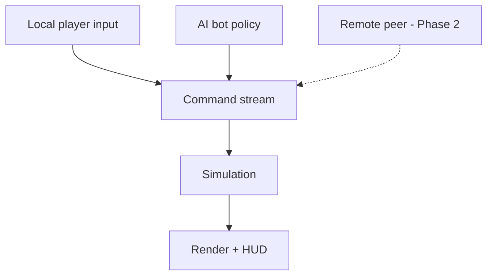

# Web FPS Arena - Plan

## Goal Capsule

- **Objective:** Build a browser-based 3D arena first-person shooter where a single player fights AI bots in deathmatch. This plan owns the single-player v1; real-time multiplayer is a named Phase 2, not active scope.
- **Product authority:** Learning/portfolio project that is also fun to play with friends. Two goals steer every tradeoff: learn 3D and game-dev concepts, and produce a portfolio-credible artifact. "Play with friends" is honored by architecting v1 so multiplayer is a later swap.
- **Open blockers:** None block planning. Match-end condition and physics-library choice are deferred to planning (see Outstanding Questions).

## Product Contract

### Summary

A single-player 3D arena FPS for the browser: move, shoot AI bots, take damage, respawn, and score in a deathmatch. Low-poly stylized visuals from free asset packs. Built on Three.js plus a physics library, with a deliberate input→command→simulation seam that removes one class of Phase-2 rework (control-source coupling); prediction, reconciliation, and server authority remain net-new multiplayer work.

### Problem Frame

The author is comfortable with JavaScript but new to 3D, and wants a project that teaches 3D and game-dev concepts (render loop, vectors, collisions, game state) without dropping to raw WebGL or shader plumbing. The result should be something they are proud to show and can send to friends to play. A full real-time multiplayer shooter is where most of that fun lives, but netcode is the hardest part of an FPS and would dominate the effort before anything is playable. Starting single-player against bots gets to a good-feeling core fast and de-risks the hard part — provided v1 is built so the eventual multiplayer work is additive.

### Key Decisions

- **Three.js + a physics library, not a batteries-included or editor-first engine.** Best fit for a JS developer who wants the 3D/game concepts while letting a library handle WebGL; deepest tutorial ecosystem; strongest "I built this" portfolio signal. (session-settled: user-directed — chosen over Babylon.js and editor-first engines: best learning + portfolio value for a JS dev.) Governs R11.
- **Single-player-first (arena vs bots) over multiplayer-from-day-one.** De-risks netcode and reaches a playable, good-feeling core quickly; multiplayer is Phase 2. (session-settled: user-directed — chosen over MP-in-v1: faster to something playable, lower risk.)
- **Bots are stand-in players behind an input→command→simulation seam.** Local player, AI bot, and future remote peer all produce the same command stream feeding one simulation, so the arena, movement, hit detection, and respawn built for v1 carry directly into multiplayer. The seam removes control-source coupling — the main structural rework multiplayer would otherwise force — but does not by itself deliver multiplayer: prediction, reconciliation, lag compensation, and server authority remain net-new Phase-2 work. (session-settled: user-directed — chosen over simplest-possible v1: modest cost now removes the control-source rework that would otherwise dominate the multiplayer transition.) Governs R10, R11.
- **Low-poly stylized art from free asset packs, not custom or realistic art.** Keeps effort on gameplay and code while staying portfolio-credible. Governs R9.

The seam behind the stand-in-player decision, shown as the fan-in it creates:

### Actors

- A1. Player — the human, controlling one avatar via mouse and keyboard.
- A2. Bot — an AI-controlled opponent avatar; stands in for a networked player.
- A3. Remote peer — a networked player. Out of scope for v1; named so the stand-in-player seam (see Key Decisions) and R10 account for it.

### Requirements

**Core gameplay**

- R1. The player and bots fight in a shared arena; eliminating an opponent scores a point for the victor.
- R2. The player fires a weapon; a hit on a bot reduces that bot's health.
- R3. Any entity whose health reaches zero dies and respawns after a short delay at a spawn point.
- R4. The match shows a running score and ends on a defined condition (score target or timer); the exact condition is deferred to planning.

**Movement & controls**

- R5. First-person movement: WASD to move, mouse-look via pointer lock, and jump; movement collides with arena geometry.

**Bots / AI**

- R6. Bots navigate the arena, pursue and engage the player, and shoot back.
- R7. Bot difficulty is tunable enough to make solo play fun — challenging but not perfectly accurate.

**Arena & presentation**

- R8. A single enclosed arena with cover geometry and multiple spawn points.
- R9. Low-poly stylized visuals from free asset packs, including player/bot avatars, a first-person weapon view, and a minimal HUD (health, score, crosshair), plus player-facing feedback for taking damage (hit indicator), the death moment, and a visible respawn countdown during the respawn delay.

**Architecture (multiplayer-readiness)**

- R10. Entity control flows through a single input→command→simulation seam. In v1 the local player and AI bot emit the same command shape consumed by one simulation. The seam is designed so a future remote peer can emit the same shape, but the remote-peer command contract itself (timestamps, input sequencing, and anything netcode requires) is deferred to Phase 2.
- R11. The simulation is separable from rendering and input so it can later run authoritatively for multiplayer.

**Deployment**

- R12. The game runs in a modern desktop browser and is deployable as a shareable static link.

**Game shell & states**

- R13. The game presents states beyond the combat loop: a start screen, the in-match combat loop, and a match-end results screen that shows the final score and offers a way to play again. Play-again restarts a match (reset scores and spawns); this is distinct from in-match respawn, which continues arena state per AE2.
- R14. Pointer lock engages on an explicit click-to-play gesture (on the start screen or a resume overlay) and releases on Esc; releasing surfaces a pause/menu overlay, and a re-engage gesture returns to combat. The browser reserves Esc for releasing the lock, so any pause affordance builds on that release rather than competing with it.

### Key Flows

- F1. Core combat loop
  - **Trigger:** Match starts; player and bots spawn.
  - **Actors:** A1, A2
  - **Steps:** Entities spawn at spawn points → player moves and aims → player and bots exchange fire → hits reduce health → an entity dies, the victor scores → the dead entity respawns after a delay → continues until the match-end condition.
  - **Covers:** R1, R3, R5, R6, R8
- F2. Shot resolution
  - **Trigger:** Player or bot fires.
  - **Actors:** A1, A2
  - **Steps:** Fire command enters the simulation → simulation resolves the shot against target geometry/entities → on hit, applies damage and feedback → if health hits zero, triggers death and scoring.
  - **Covers:** R2, R3, R10
- F3. Match lifecycle
  - **Trigger:** The player loads the game in the browser.
  - **Actors:** A1
  - **Steps:** Start screen (a click engages pointer lock) → in-match combat loop (F1) → match-end condition met → results screen shows final score → player chooses play again (restart) or return to start.
  - **Covers:** R4, R13, R14

### Acceptance Examples

- AE1. **Covers R2, R3.** Given a bot at full health, When the player lands enough hits to bring it to zero health, Then the bot dies, the player's score increases by one, and the bot respawns at a spawn point after the delay.
- AE2. **Covers R3.** Given the player is killed by a bot, When the respawn delay elapses, Then the player respawns at a spawn point with full health and the arena state continues (no full reset).
- AE3. **Covers R5.** Given the player holds a movement key toward a wall, When the avatar reaches the wall, Then movement stops at the surface rather than passing through.
- AE4. **Covers R10.** Given an AI bot and (later) a remote peer, When each issues a "fire" action, Then both produce the same command shape and the simulation resolves them identically.

### Success Criteria

- Movement and shooting feel responsive and good — the portfolio-quality bar for the core loop. Because "feels good" is subjective, it is judged against an observable proxy set in planning: a named reference game's responsiveness, an input-to-render latency budget in milliseconds, and a lightweight playtest gate (e.g., 3 of 3 first-time testers play more than 5 minutes unprompted).
- Fighting crude "dumb bots" that merely move and shoot back is already fun — this minimal bar is validated early, before investing in navigation or cover AI.
- Sustains ~60fps in a modern desktop browser during normal arena combat, measured at the v1 target bot count (set in planning) rather than a single bot.
- The full deathmatch loop works end to end: spawn, kill, score, respawn, match end.
- Deployable as a link the author can send to a friend to try.
- Visuals read as intentional and clean — portfolio-credible, not placeholder-looking.

### Scope Boundaries

**Deferred for later**

- Real-time multiplayer and netcode — the explicit Phase 2.
- Accounts, persistence, leaderboards, matchmaking.
- Multiple maps or campaign/level content — v1 is one arena.
- Audio design — a nice-to-have, not part of the v1 core.
- Mobile and touch controls.

**Outside this product's identity (for now)**

- Anti-cheat and server-authoritative competitive fairness — not relevant until multiplayer.
- Monetization.

### Dependencies / Assumptions

- Target is desktop with mouse and keyboard only; pointer-lock aiming is assumed.
- Animated humanoid bot/player models are among the harder tasks for someone new to 3D, so the first playable build may use simple placeholder geometry, with asset-pack models swapped in afterward — "low-poly stylized" is the v1 destination, not necessarily the first commit.
- Chosen free asset packs carry licenses compatible with a public portfolio piece.
- Bot behavior is the primary risk to the "fun solo" payoff — bot AI is the hardest FPS subsystem and its approach is deferred to planning. Plan around proving the minimal "dumb bots are fun" bar before scaling AI investment, so a bad-feeling result surfaces cheaply.

### Outstanding Questions

**Deferred to Planning**

- Physics library choice (e.g., Rapier, Cannon-es, Ammo) and how much of the character controller it provides vs. hand-rolled.
- Weapon resolution model: hitscan vs. projectile (R2/F2). Feel-load-bearing — it shapes shooting feel and later netcode, so decide it before the fire command shape is frozen.
- Match-end condition: score target vs. round timer (R4).
- Number of bots and their AI approach (steering/navmesh/simple heuristics).
- Specific free asset packs and the weapon/avatar set.
- Build tooling, bundler, and static hosting target.
