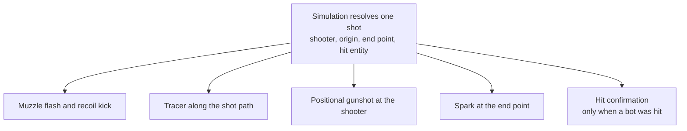

# Combat Feel and Lighting - Plan

## Goal Capsule

- **Objective:** Make firing a weapon feel like something, and make the arena read as a lit place rather than untextured primitives — without changing the arena's geometry or the simulation beneath it.
- **Product authority:** Learning/portfolio project that is also fun to play with friends, carried from `docs/plans/2026-08-03-001-feat-web-fps-arena-plan.md`. This pass is judged by playing it, not by a screenshot.
- **Open blockers:** None. Sourcing a usable weapon model is the only step whose duration is not controlled.

---

## Product Contract

### Summary

A render-and-feedback pass in two halves: making the act of shooting produce visible and audible consequence, and lighting the scene properly. Sound comes off the earlier plan's deferred list, scoped to gunshots. The arena's box geometry and the entire simulation stay as they are.

### Problem Frame

Asset integration only half-landed. The character rig loads and animates, but the arena is still the placeholder built during early development — a flat-colour ground plane, four untextured wall boxes, and brown cover boxes, with a comment in `src/render/arenaMesh.js` still promising it will be swapped later. The first-person weapon is a literal `0.08 × 0.08 × 0.35` box, because the pistol that was downloaded turned out to be a skinned mesh with a baked 100× scale and was left unwired.

Underneath that, nothing in `src/` enables shadows, tone mapping, or environment lighting. One ambient term and one directional light, and no object casts a shadow onto anything. The result is that even the character model — a real, animated, properly-sourced asset — reads as a sticker floating above the ground, because nothing anchors it there.

Firing compounds it. A shot kicks the viewmodel `0.06` units, flashes a light for `0.05` seconds, and draws a one-pixel line for `0.08` seconds. Nothing marks where the bullet landed, and a shot that kills a bot looks identical to one that sails past it. The player's attention is on the far end of the arena, which is exactly where the game currently shows them the least.

### Key Decisions

- **Render quality, not new geometry.** The box silhouettes are not what reads as fake; the flat lighting and untextured surfaces are. (session-settled: user-approved — chosen over replacing the arena's geometry: the shapes were confirmed not to be the problem.) Governs R12, R13, R14, R17.
- **Lighting stops at shadows, tone mapping, and sky-based ambient.** (session-settled: user-directed — chosen over a gritty PBR-textured treatment: too much work, and its fog and dark palette would fight target readability in a shooter.) Governs R12, R13, R14, R15.
- **Recoil is cosmetic and never moves the aim point.** (session-settled: user-approved — chosen over recoil that climbs the aim: keeps the simulation untouched and the tuned bot difficulty valid.) Governs R5, R17.
- **Impact feedback is a spark burst at the hit point, not a wall decal.** A spark needs only the end point the simulation already returns; a decal needs a surface normal it does not, plus lifetime capping to hold the memory bar. Governs R7.
- **Assets land before lighting.** (session-settled: user-directed — chosen over lighting first: matches the stated priority. Accepted cost is tuning muzzle-flash and tracer brightness twice, once under the current renderer and again after tone mapping lands.)
- **Gunshot audio is in scope, positional for every shooter.** (session-settled: user-directed — chosen over a visual-only punch pass: sound is the largest single contributor to weapon punch, and positional bot fire pairs with the directional damage indicator already in `src/render/feedback.js`.) Governs R9, R10, R11.
- **The earlier plan's art-direction decision is amended, not overturned.** KTD6 in `docs/plans/2026-08-03-001-feat-web-fps-arena-plan.md` constrains asset *sourcing* to low-poly free packs, and that still holds. What changes is the render treatment beneath those assets.

### Requirements

**Weapon and character assets**

- R1. The first-person weapon view shows a recognisable firearm instead of placeholder geometry.
- R2. The weapon model is chosen for compatibility with the existing static-prop load path rather than adapted after sourcing.
- R3. Bots render as a robotic character rather than the current humanoid base character.
- R4. The replacement bot preserves clip selection from the simulation's existing idle / moving / firing / dead animation hints.

**Shooting feedback**

- R5. Firing produces a recoil kick and muzzle flash strong enough to read at a glance, without moving the aim point.
- R6. Every shot draws a tracer that stays legible at the arena's full engagement range.
- R7. A shot produces a brief impact effect at the point where it terminates.
- R8. A shot that hits a bot produces a hit confirmation the player can distinguish from a miss without watching the health bar.

**Audio**

- R9. Firing plays a gunshot sound.
- R10. Bot gunshots are audible and positioned in the world, so the player can tell roughly where fire is coming from.
- R11. Audio follows the existing session lifecycle: it becomes available through the click-to-play gesture and is silent while the game is paused.

**Scene lighting**

- R12. Characters, cover, and walls cast and receive shadows, so objects are visibly grounded to the surface beneath them.
- R13. The renderer applies tone mapping, so bright effects roll off instead of clipping to flat white.
- R14. Ambient light derives from a sky-based environment rather than a single flat ambient term.
- R15. Bots stay clearly distinguishable from the surfaces behind them at the arena's full engagement range.
- R16. The arena's existing colours are reused as-is — this pass adds no textures.

**Non-regression**

- R17. Collision, spawn points, cover placement, hitscan resolution, and bot difficulty are unchanged.
- R18. A failed asset load still falls back to placeholder geometry and never blocks startup.

### Key Flows

- F1. The player fires a shot
  - **Trigger:** The player clicks while pointer lock is engaged and the weapon is off cooldown.
  - **Steps:** The viewmodel kicks and flashes; a gunshot plays; a tracer draws along the shot path; a spark appears where the shot terminates; if a bot was hit, a hit confirmation fires.
  - **Outcome:** The player knows a shot went out, roughly where it went, and whether it landed — without reading the HUD.
  - **Covers R5, R6, R7, R8, R9.**

- F2. A bot fires at the player
  - **Trigger:** A bot in its attacking phase resolves a shot.
  - **Steps:** A gunshot plays positioned at that bot; a tracer draws along its shot path; a spark appears where the shot terminates.
  - **Outcome:** The player can orient toward incoming fire from sound alone, before the damage indicator confirms it.
  - **Covers R6, R7, R10.**

### Acceptance Examples

- AE1. Given a shot that hits a bot, When it resolves, Then the player sees a confirmation distinct from what a miss produces. **Covers R8.**
- AE2. Given a bot firing from behind the player, When the shot resolves, Then the gunshot is heard from that direction. **Covers R10.**
- AE3. Given the game is paused, When time passes, Then no gunshots play. **Covers R11.**
- AE4. Given a bot at the far end of the arena, When the player looks at it, Then it is distinguishable from the surface behind it. **Covers R15.**
- AE5. Given a weapon or character asset that fails to load, When the match starts, Then placeholder geometry renders and the match is playable. **Covers R18.**
- AE6. Given the player fires while aiming at a fixed point, When the recoil animation plays out, Then successive shots still land at that point. **Covers R5, R17.**

### Success Criteria

- Sustains ~60fps in a desktop browser at the v1 bot count, carried from `docs/plans/2026-08-03-001-feat-web-fps-arena-plan.md`.
- `renderer.info.memory` plateaus across a long match with repeated firing and respawns.
- Added asset weight is justified against the current 6.02 MB build, of which 2.42 MB is already GLB.
- Firing reads as having weight, and whether a shot landed is never ambiguous — judged by playing, not by inspection.

### Scope Boundaries

Deferred for later:

- The gritty atmospheric treatment: PBR textures, environment reflections, heavy fog, dark palette.
- Wall decals at bullet impacts.
- Recoil that moves the aim point — a gameplay change that would require re-tuning bot difficulty.
- Any change to arena geometry, layout, or cover placement.
- All audio other than gunshots: music, footsteps, ambience, damage and death sounds.

### Dependencies / Assumptions

- A static, non-skinned weapon model must be sourced. The shipped `public/assets/weapons/quaternius-pistol.glb` is skinned with a baked 100× scale split across its armature and mesh nodes and is not usable; `src/main.js` records the three scale attempts that failed and concludes re-sourcing is required.
- A robot from the same Quaternius rig family preserves the clip names hardcoded in `src/render/mixer.js`. A rig from elsewhere means remapping animation hints to clip names.
- New models and audio carry a license compatible with a public portfolio piece, and are credited in `CREDITS.md` before the work is shared. The existing assets are CC BY 3.0 and already require attribution.
- Browsers block audio until a user gesture. The existing click-to-play pointer-lock gesture is the natural unlock point.
- The target remains desktop WebGL, not WebGPU.
- Two render tests break on any added mesh: `test/render/arenaMesh.test.js` asserts an exact child count, and `test/render/weaponView.test.js` destructures the weapon group's children positionally. `test/smoke.test.js` asserts at least two lights, so added lights are safe.

### Outstanding Questions

Deferred to Planning:

- Which specific weapon and robot models, from which packs.
- Whether the tracer needs to become a beam mesh, since `LineBasicMaterial` line width is ignored on most WebGL platforms and the current tracer cannot be thickened directly.
- How impact sparks are pooled and capped to keep memory flat.
- Whether shadow map resolution needs compromise to hold the frame budget.
- Whether the unused pistol GLB and the stray `.DS_Store` should be dropped from the build; both are currently copied into `dist/` verbatim.

### Sources / Research

- `src/render/arenaMesh.js` — the placeholder arena: flat-colour ground plane, four wall boxes, one box per cover box.
- `src/render/scene.js` — the entire lighting rig: one ambient light, one directional light, flat background colour, linear fog.
- `src/render/weaponView.js` — the placeholder weapon box, the recoil and muzzle-flash constants, and the `setModel` seam that accepts a replacement model with a local transform.
- `src/sim/weapon.js` — `resolveFire` already returns the shooter's origin, the shot's end point, and the hit entity id on a fired shot, which is everything the feedback work needs. It uses `castRay` and obtains no surface normal.
- `src/render/tracer.js` — the current tracer: a `THREE.Line` with an 0.08-second lifetime.
- `src/render/mixer.js` — animation hint to clip mapping, with clip names hardcoded to the current rig. The death lookup is name-agnostic; the other three are not.
- `src/main.js` — the character model load, its yaw and vertical origin corrections, the placeholder fallback path, and the record of why the pistol was left unwired.
- `src/arena/arena.js` — owns every Rapier collider. The renderer reads only ground size, wall height, and cover boxes from it, so visuals can change without touching collision.
- `docs/plans/2026-08-03-001-feat-web-fps-arena-plan.md` — R9 and KTD6 for art direction, and the frame-rate and memory bars this pass inherits.
