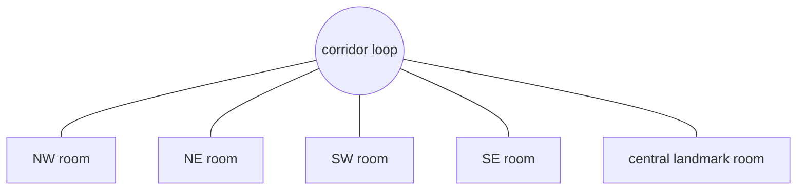
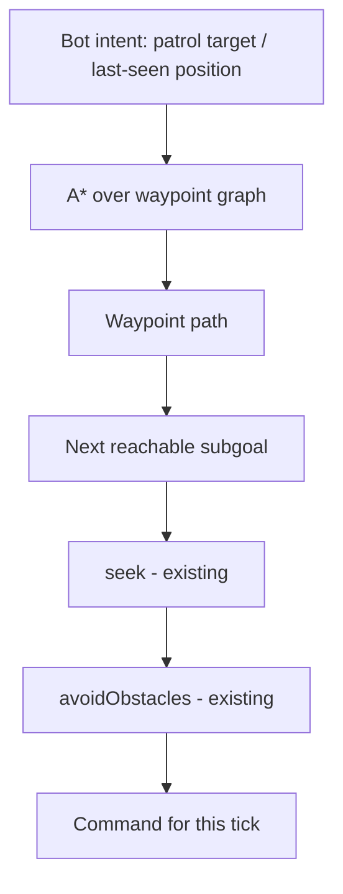
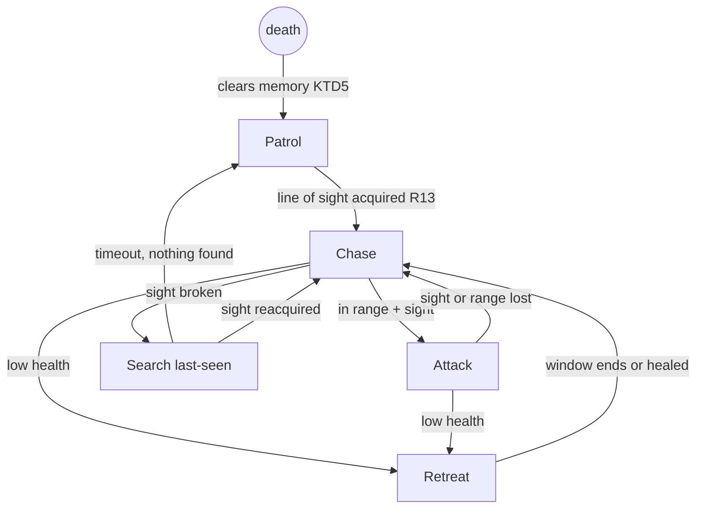

# Rooms-and-Corridors Arena - Plan

## Goal Capsule

- **Objective:** Replace the open-box arena with a rooms-and-corridors map tuned for hunt-and-ambush deathmatch, including the bot navigation and line-of-sight sensing the occluded layout requires. This plan owns the arena overhaul only; the other variety areas (weapons, match presentation, pickups, verticality) are not active scope.
- **Product authority:** The Product Contract governs product behavior; the Planning Contract governs mechanism within it. The U1 spike verdict may revise KTD2 (navigation mechanism) only — never product scope.
- **Stop conditions:** If the U1 spike fails for both the primary mechanism and its named fallback, stop and revisit the plan. Any change to product scope goes back to the owner, not into code.
- **Execution profile:** Phased. Each unit ends with a human play-check before the next begins (validate before extending). Bot-AI feel and pacing are human-validated; tests cannot judge them.
- **Open blockers:** None.

---

## Product Contract

### Summary

Replace the single-box arena with a rooms-and-corridors map — corner rooms and a central landmark connected by a corridor loop — where no position sees the whole map. Teach the bots to navigate it (patrol between rooms, pursue through doorways, disengage out of sight) and to sense honestly (line-of-sight acquisition, last-seen-position memory), and retune contact density so a match plays as hunt-and-ambush where knowing the map pays off.

### Problem Frame

The game is mechanically complete but plays as "fighting bots in a box": one convex 60×60 arena, constant contact, no reason to learn the space. The owner calls the current pacing overwhelming and boring — you are never out of a fight, so no fight feels like an event.

This is a learning/demo project. The audiences are a recruiter or colleague clicking a portfolio link, a friend playing a match, and readers of a build-log blog — but the feature must be worth building at zero audience: the owner wants a durable learning takeaway and a game they enjoy because it is theirs. Map construction, pathfinding, and sensing models are that takeaway; they are the classic next milestones after a first FSM shooter.

### Key Decisions

- KD1. **Rooms-and-corridors loop** — chosen over a scaled open arena with cover and a vertical catwalk arena (session-settled: user-directed — picked from visual layout sketches: the only shape where map knowledge is structural rather than cosmetic, and it forces real bot navigation, which is the learning goal). Governs R1–R4.
- KD2. **Hunt-and-ambush pacing** — chosen over today's constant contact (session-settled: user-directed — current pacing described as overwhelming and boring). Governs R10–R12.
- KD3. **The new map replaces the old arena outright** — no map selector, old box retired (session-settled: user-approved). Governs R5.
- KD4. **Geometry and existing lighting style only** — rooms read distinct through shape and light, not a texture/art theming pass (session-settled: user-approved). Governs R4.
- KD5. **Bot navigation mechanism is settled by a spike** — no commitment to waypoint graph vs alternatives until one is prototyped. Governs R6.

### Requirements

**Map**

- R1. The arena is distinct rooms connected by corridors in a loop — directionally: four corner rooms plus a central landmark room; exact dimensions and room count are settled in U2.
- R2. No reachable position sees the whole map; every engagement starts with partial information.
- R3. Every room has at least two exits; no dead-end pocket can trap a player or bot.
- R4. Rooms are distinguishable at a glance through proportions, landmark geometry, or lighting, so returning players build a mental map.
- R5. The new map replaces the current arena; the match flow (start, pause, results, play again) is unchanged.

Directional connectivity only — exact doors, counts, and sizes are U2 decisions.

**Bot navigation and sensing**

- R6. Bots can reach any room from any room via corridors without getting stuck; the mechanism is settled by the U1 spike.
- R7. A bot with no target patrols — it moves between rooms rather than idling where it spawned.
- R8. When a chased target breaks line of sight, the bot pursues to the last-seen position, searches briefly, then resumes patrol; it never tracks a target through walls.
- R9. Existing bot phases (chase, attack, retreat) work in the new geometry; retreat disengages through a doorway to break line of sight.
- R13. A bot acquires a target only through line of sight; occluded proximity alone never starts a chase.

**Pacing**

- R10. Contact density is retuned for hunt-and-ambush: engagements are less frequent than in the current arena and tend to start at closer range.
- R11. Entity placement — respawn, mid-match bot activation, and match start — puts the entity out of living enemies' line of sight; when no such point exists, the point visible to the fewest enemies wins, ties broken by greatest distance. Match start additionally places no two entities in mutual view.
- R12. Match parameters (kill target, bot ramp) are retuned if hunt pacing makes matches drag.

### Key Flows

- F1. Player hunt loop
  - **Trigger:** Match running, player between fights.
  - **Steps:** Player moves through corridors reading rooms; spots or hears a bot; positions at a doorway or corner; engages on their terms; wins or disengages and repositions.
  - **Covers:** R2, R3, R10.
- F2. Bot hunt and lost contact
  - **Trigger:** Bot has no target.
  - **Steps:** Bot patrols between rooms; senses the player through line of sight; chases toward the player's last-seen position through corridors; if sight breaks, continues to that position and searches; resumes patrol if nothing is found.
  - **Covers:** R6, R7, R8, R13.
- F3. Retreat under fire
  - **Trigger:** Bot health drops below the retreat threshold mid-fight.
  - **Steps:** Bot disengages toward a doorway, breaks line of sight into an adjacent room, recovers or re-engages per existing FSM rules.
  - **Covers:** R9.

### Acceptance Examples

- AE1. **Covers R6, R7.** Given a bot with no target and the player two rooms away, when 20 seconds pass, then the bot has moved through at least one doorway and has not been stuck against any wall.
- AE2. **Covers R8.** Given a bot chasing the player, when the player turns a corridor corner and breaks line of sight, then the bot continues to the corner and searches; it does not steer toward the player's new hidden position.
- AE3. **Covers R11.** Given the player dies and respawns, then no living enemy has line of sight to the chosen spawn point — or, when every spawn point is visible to someone, the chosen point is visible to the fewest living enemies. The same rule holds when a parked bot activates mid-match.
- AE4. **Covers R2.** Given any reachable standing position, then at least one room is fully hidden from it.
- AE5. **Covers R13.** Given a bot within awareness distance of the player but separated by a wall with no line of sight, then the bot stays in patrol.

### Success Criteria

- A full match plays as stalk, fight, reposition — validated by the owner playing it: fights feel less constant and more decisive than in the current arena. Feel is human-validated; tests cannot judge it.
- Map knowledge pays: after a few matches the player can name ambush spots and predict bot routes.
- ~60fps at max bot count in the new map — the v1 plan's performance gate, a target to re-verify here, not a previously recorded measurement.
- No bot is visibly stuck at any point across a full match.

### Scope Boundaries

- Weapon variety, the match presentation layer (killfeed, scoreboard, ammo HUD), and pickups — shelved future candidates, see How This Work Fits Together.
- Bot-vs-bot targeting — bots keep hunting only the player (KTD4); accidental crossfire behavior is unchanged.
- Verticality (catwalks, ramps) — deferred; may graft onto this map later.
- Roofed rooms and interior lighting — excluded (KTD8).
- Texture/art theming pass — excluded per KD4.
- Keeping the old arena selectable — excluded per KD3.
- Still out of scope from the v1 plan: multiplayer, mobile/touch, audio beyond gunshots, accounts/leaderboards.

<!-- ce-section: work-relationships -->
### How This Work Fits Together

This plan owns the arena overhaul: map, bot navigation and sensing, pacing. The breakdown below is the current understanding of the surrounding variety work, not a committed roadmap; a later plan may revise, split, merge, or discard these.

- Weapon variety (2–3 distinct guns, switching, ammo) — can proceed independently of this plan.
- Match presentation (killfeed, live scoreboard, ammo/weapon HUD, end-of-match stats) — can proceed independently.
- Pickups (health, armor, weapon spawns) — enabled by this plan: rooms give item placement meaning; still to decide.
- Bot-vs-bot targeting — enabled by this plan's sensing rebuild (last-seen memory generalizes to multiple targets); still to decide.
- Verticality (a catwalk or upper deck on one room) — depends on this plan's map; still to decide.

### Dependencies / Assumptions

- Verified: no pathfinding exists today — bot movement is seek/flee/wander steering plus raycast obstacle deflection, and the code records that this design assumes the convex arena (src/sim/bot/steering.js:1-6). The navigation-plus-sensing upgrade is the load-bearing new work.
- Verified: bots currently acquire targets through walls — chase triggers on `hasLineOfSight || distance <= AWARENESS_RANGE` (src/sim/bot/fsm.js:70) and chase steers at the live player position each tick. R13 removes this.
- Verified tuning anchors that become retuning surfaces: awareness 50 / attack 25 / retreat below 30 HP / retreat 180 ticks (src/sim/bot/fsm.js); aim spread 0.15 (src/sim/bot/difficulty.js); bots ramp 2→4 (src/shell/botRamp.js, src/main.js); 10 kills to win (src/shell/matchEnd.js); fog 35–110 and shadow extent 34 (src/render/scene.js).
- Assumption, gated by U1: the Rapier character controller (capsule radius 0.4, src/sim/movement.js) traverses 2-unit doorways without snagging.
- Assumption: the new map keeps one continuous floor collider so the bot parking position (src/main.js `PARK_POSITION`, y=-100) stays safe; U2 verifies or re-derives it.

### Sources / Research

- src/sim/bot/steering.js, src/sim/bot/fsm.js — steering primitives, FSM thresholds, the through-wall acquisition OR-condition.
- src/arena/arena.js + src/render/arenaMesh.js — cover boxes are single-sourced from one descriptor array; boundary walls are derived twice (physics and render separately); U2 closes this gap.
- src/render/scene.js — shadow camera sized to the old arena (`SHADOW_EXTENT = 34`); silently drops shadows beyond it.
- docs/solutions/logic-errors/ — two bot-AI bug writeups; both directly constrain this work (see KTD1, KTD5). Read before touching bot code.
- recast-navigation-js, three-pathfinding, yuka — surveyed navmesh/graph libraries; at 4 bots on one hand-built map a hand-authored waypoint graph is proportionate, with three-pathfinding as the library fallback (its navmesh can be generated by recast-navigation-js's generator if ever needed).
- GameAI Pro 2, Ch. 27 "Looking for Trouble" (gameaipro.com) — canonical last-seen-position search behavior: brief pursuit on intuition, then search spots past the occluder, then give up.
- Plus Forward, "The Language of Arena FPS Level Design" — lanes converging on contested space, no dead ends, sightline length as weapon balance; informs U2 layout.

---

## Planning Contract

Product Contract preservation: restructured, no scope change except — added R13 and AE5 (line-of-sight acquisition; entailed by R2/R8 once research showed chase currently triggers through walls); R11/AE3 extended to govern bot activation and match start, with a least-visible fallback (the absolute rule was unsatisfiable with five entities on a loop map); Outstanding Questions resolved in place into KTDs and units.

### Key Technical Decisions

- KTD1. **Navigation is a new layer above steering, never a change to it.** A path source produces the next locally-reachable subgoal each tick; `seek` and `avoidObstacles` consume it unchanged. The deflection math in src/sim/bot/steering.js is a previously-fixed bug (docs/solutions/logic-errors/bot-obstacle-avoidance-reversal.md) and stays untouched; its tests stay green. Cites R6–R8.
- KTD2. **Primary mechanism: hand-authored waypoint graph (room and doorway nodes) with A*, committed only after the U1 spike.** External research: navmesh libraries are over-scoped for 4 bots on one hand-built map; fallback if the spike fails is three-pathfinding over a generated navmesh. Instantiates KD5; cites R6.
- KTD3. **Sensing is rebuilt as line-of-sight acquisition plus last-seen-position memory.** Chase and search steer at the remembered position, never at a live occluded position. Governs R13; cites R2, R8.
- KTD4. **Player-only bot targeting is retained** (session-settled: user-approved — chosen over bot-vs-bot sensing: it would roughly double sensing scope). Accidental crossfire damage and scoring are unchanged. For R11 placement rules, "enemy" means every living entity. Cites R11.
- KTD5. **Bot AI state lifecycle rules:** all new timers are sim-tick-denominated; death clears target memory, search state, and path; match reset reinitializes bot AI state. This is the guardrail against the retreat-survives-death bug class (docs/solutions/logic-errors/bot-retreat-survives-death.md) — a last-seen pursuit timer is structurally identical to the bugged retreat deadline. Cites R5, R8.
- KTD6. **The arena becomes one descriptor dataset consumed by both physics and render**, extending the existing cover-box pattern to walls, rooms, doorways, and spawn points — closing the current duplicate wall derivation. Cites R1, R5.
- KTD7. **Spawn line-of-sight filtering pre-filters candidates at the call sites** (health respawn, ramp activation, match reset), keeping src/arena/spawns.js physics-free; fallback is fewest-observers, ties by distance (session-settled: user-approved — the fallback replaces an unsatisfiable absolute rule). Governs R11.
- KTD8. **Rooms are open-topped** (session-settled: user-approved — chosen over roofed rooms: the render layer has exactly one sun plus hemisphere ambient, and roofs would require an interior lighting subsystem from zero). Shadow extent and fog are retuned to the new footprint. Cites R4.
- KTD9. **Doorways are at least 2 units wide (2.5× capsule diameter); doorway contention resolves by repathing via the loop's alternate route** — the reason R3 guarantees two exits. U1 proves the width; U3 implements the repath. Cites R3, R6.

### High-Level Technical Design

Navigation data flows one way — the graph plans, steering executes:

Bot phases gain one state and one gate; existing transitions stay:

### Risks

- The U1 spike may show the character controller snags on doorways — fallback: widen doorways, then three-pathfinding (KTD2). Both failing is a stop condition.
- The sensing rebuild churns tuned bot behavior — mitigated by regression tests shaped like the two documented bot bugs and by relative-arithmetic test assertions.
- Two bots contesting one doorway can jam — U1 runs an instrumented two-bots-one-doorway sim (stuck-tick tally) before the map exists.
- Per-tick line-of-sight raycasts grow (sensing + spawn filtering) — bounded by 4 bots and 6 spawn points; verify with the stats overlay at U6.

---

## Implementation Units

### U1. Navigation and doorway spike (throwaway)

- **Goal:** Settle KTD2 and KTD9 with running code before any real map work.
- **Requirements:** R6, R13 (proves the machinery for both). Instantiates KD5.
- **Dependencies:** None.
- **Files:** Scratch only (e.g. `spike/` — deleted when the unit closes). The verdict lands in this plan: KTD2 confirmed or flipped to fallback, doorway floor confirmed or widened.
- **Approach:**
  1. Hand-build a two-room Rapier world with one 2-unit doorway.
  2. Hand-author a 4–6 node waypoint graph; implement throwaway A* + path following feeding `seek`/`avoidObstacles`.
  3. Drive a bot capsule room-to-room; tally stuck ticks.
  4. Add last-seen memory: break line of sight, confirm pursue-to-corner then search then give-up (the AE2 shape).
  5. Run two bots through one doorway for 60 sim-seconds; tally stuck ticks and oscillation.
- **Execution note:** Throwaway code, no production quality bar; delete the scratch directory at the end. The deliverable is the recorded verdict, not code.
- **Test scenarios:** Test expectation: none — spike code is deleted; its findings become U3/U4 tests.
- **Verification:** Owner watches the spike scene (or its logged tallies): bot crosses rooms without sticking, search behavior reads correctly, two-bot doorway run ends with zero sustained jams.
- **Verdict (recorded, spike deleted):** KTD2 **confirmed** — hand-authored waypoint graph + A* crossed rooms in 166 ticks (2.77s) with zero stuck ticks; two bots contesting one doorway for 3600 ticks (60s) both arrived with max 1 stuck tick each, far under the sustained-jam threshold, so no fallback to three-pathfinding is needed. KTD9 **confirmed** — the 2-unit doorway width is sufficient as-is; U3 still implements alternate-route repathing per KTD9's contention-avoidance rationale, but width itself needs no widening. Last-seen pursuit/search shape validated: chase steers at live position while visible, freezes at the last-seen point the instant sight breaks, reaches it via the graph, and never re-targets the target's continued live movement during search (feeds U4 directly).

### U2. Rooms-and-corridors arena, descriptor-driven

- **Goal:** The new map exists, collides, renders, and is lit correctly — replacing the box outright.
- **Requirements:** R1–R5, R2 sightline checks; advances AE4.
- **Dependencies:** U1 (doorway width verdict).
- **Files:** src/arena/layout.js (new descriptor dataset: walls, rooms, doorways, spawn points), src/arena/arena.js, src/render/arenaMesh.js, src/render/scene.js (fog, shadow extent), src/arena/spawns.js (spawn data only), src/main.js (verify `PARK_POSITION` against the continuous floor), test/arena/arena.test.js, test/render/arenaMesh.test.js, test/arena/spawns.test.js.
- **Approach:**
  1. Define the layout as one descriptor dataset (KTD6): four corner rooms, central landmark room, corridor loop, doorways ≥ 2 units (KTD9), no dead ends (R3), spawn points distributed across rooms.
  2. `createArena` builds colliders from descriptors; `buildArenaMeshes` consumes the same descriptors — the duplicate wall derivation dies here.
  3. Keep one continuous floor collider; retune `FOG_NEAR/FOG_FAR` and `SHADOW_EXTENT`/shadow camera to the new footprint.
  4. Distinguish rooms by proportion and landmark geometry within the existing material/lighting style (KD4, KTD8).
- **Execution note:** Bots will behave poorly in this map until U3/U4 land — expected; note it, don't patch steering.
- **Test scenarios:**
  - Every doorway in the descriptor dataset is ≥ 2 units wide; every room has ≥ 2 doorways (data-level asserts on layout.js).
  - Collider count and mesh count both derive from the same descriptor list (parity assert replaces the hardcoded 4-wall count in test/render/arenaMesh.test.js).
  - A ray between two positions in different rooms with no shared doorway sightline is blocked (rewrites the LOS regression in test/arena/arena.test.js for the new layout).
  - Covers AE4 (design-level): from a sampled grid of standing positions, each has ≥ 1 fully-occluded room (test over layout data with representative samples).
  - Spawn points: all inside rooms, none inside geometry, pairwise separation respected.
- **Verification:** `npm test` green; `npm run build` green; owner walks the map — layout reads, rooms distinguishable, shadows everywhere, ~60fps on the stats overlay.

### U3. Waypoint graph and patrol

- **Goal:** Bots traverse the real map: graph data, navigation module, patrol replaces wander.
- **Requirements:** R6, R7; advances AE1.
- **Dependencies:** U1 (mechanism), U2 (map).
- **Files:** src/sim/bot/navigation.js (new: graph, A*, path follower), waypoint node data in src/arena/layout.js (rooms/doorways already carry positions), src/sim/bot/fsm.js (idle branch: patrol via navigation; obstacle avoidance now also runs while patrolling), test/sim/bot/navigation.test.js, test/sim/botAI.test.js, test/support/rig.js (new shared physics-rig helper).
- **Approach:**
  1. Structural pre-step, own commit: extract the duplicated Rapier test-rig construction into test/support/rig.js (tidy first — no behavior change).
  2. Navigation module mirrors the fsm.js pure-core/stateful-wrapper split; stays Three-free (the architecture guard test covers it automatically).
  3. Patrol picks the least-recently-visited room (prevents all bots converging on one room); path feeds subgoals to `seek`, then `avoidObstacles` — per KTD1.
  4. Blocked-doorway detection repaths via the alternate route (KTD9).
- **Execution note:** Test-first for graph and path-following logic — this is pure sim math with no UI dependency.
- **Test scenarios:**
  - A* returns the shortest room sequence between any two rooms in the shipped graph; unreachable input throws (never returns null).
  - Path follower advances the subgoal when within arrival radius; final-node arrival ends the path.
  - Patrol target selection never picks the current room and rotates across rooms over repeated picks.
  - Covers AE1: integration — a bot in the real arena world with no target crosses ≥ 1 doorway within 20 sim-seconds, zero sustained stuck ticks.
  - Doorway blocked by a second capsule → repath chooses the loop's other route.
  - Existing steering tests stay green (KTD1's untouched-math guarantee).
- **Verification:** `npm test` green; owner watches bots patrol the map without sticking; AE1 observed live.

### U4. Sensing rebuild: acquisition, last-seen pursuit, search

- **Goal:** Bots sense honestly and hunt believably; the wallhack dies.
- **Requirements:** R8, R13; advances AE2, AE5.
- **Dependencies:** U3.
- **Files:** src/sim/bot/fsm.js (LOS-gated acquisition; last-seen memory; search phase; tick-denominated timers; death-clear per KTD5), src/main.js (match-reset reinitializes bot AI), src/render/mixer.js only if the new search phase needs an animation hint mapping, test/sim/botAI.test.js.
- **Approach:**
  1. Acquisition: replace the `hasLineOfSight || distance` OR with LOS-gated detection within awareness range (R13).
  2. Chase steers at last-seen position, refreshed while sight holds (KTD3); sight broken → Search: go to last-seen, hold briefly, then give up to patrol (GameAI Pro search shape, simplified to one search spot for v1).
  3. All timers in sim ticks; death clears memory/search/path; `onRestart` reinitializes bot AI (KTD5).
- **Execution note:** Test-first, and write the death-mid-search regression before the feature: drive a bot through death during Search and assert clean respawn behavior — the shape of test/sim/botAI.test.js's retreat-death block.
- **Test scenarios:**
  - Covers AE5: bot within awareness range but occluded stays in patrol.
  - LOS acquired → chase; live position updates last-seen while visible.
  - Covers AE2: sight broken mid-chase → bot path targets the last-seen point, dwells the search window, then returns to patrol; it never steers toward the hidden player's live position.
  - Bot dies during Search → respawns in patrol with no target memory (regression, KTD5).
  - Match reset during Search → next match starts with reinitialized bot AI (regression, KTD5).
  - Search timer counts sim ticks only — a paused sim does not consume the window.
- **Verification:** `npm test` green; owner breaks line of sight around a corner and watches the bot search the corner, then give up (AE2 live).

### U5. Retreat routing and placement rules

- **Goal:** Retreat uses the map; every placement path honors the line-of-sight rule.
- **Requirements:** R9, R11; advances AE3.
- **Dependencies:** U4.
- **Files:** src/sim/bot/fsm.js (retreat targets the exit farthest from the attacker via navigation), src/sim/health.js (respawn LOS pre-filter), src/shell/matchEnd.js (match-start placement), src/main.js (ramp-activation placement; thread `rapierWorld` to the call sites), src/arena/spawns.js stays physics-free (KTD7), test/sim/botAI.test.js, test/shell/matchEnd.test.js.
- **Approach:**
  1. Retreat: navigate toward the current room's exit farthest from the attacker, regardless of sight (R9); timer-expiry semantics unchanged.
  2. Placement (KTD7): call sites pre-filter spawn candidates by enemy LOS; fallback fewest-observers, ties by distance; match start additionally rejects mutually-visible pairs; ramp activation uses the same filter (this path shipped a spawn-on-player bug before).
- **Test scenarios:**
  - Retreating bot's movement target is a doorway node, not a bare away-vector, when an attacker blocks the direct line.
  - Covers AE3: respawn with one occluded spawn available → that spawn chosen; all spawns visible → fewest-observers wins, distance breaks ties.
  - Ramp activation applies the same filter (regression against the historical spawn-on-player bug).
  - Match start: no two entities mutually visible in the shipped layout (integration over real arena).
  - `pickSpawnPoint` itself remains physics-free (no Rapier import — data-level assert or code review gate).
- **Verification:** `npm test` green; owner plays: respawns never face an instant firefight, retreating bots slip through doorways.

### U6. Pacing retune and live-play validation

- **Goal:** The match rhythm is hunt-and-ambush, validated by play, at 60fps.
- **Requirements:** R10, R12; Success Criteria gate.
- **Dependencies:** U5.
- **Files:** src/sim/bot/fsm.js (awareness/attack ranges, retreat window), src/sim/bot/difficulty.js (aim spread vs closer ranges), src/shell/botRamp.js, src/shell/matchEnd.js (kill target if matches drag), src/render/scene.js (final fog/shadow pass), affected tests.
- **Approach:** Retune constants against the real map scale by live play — this codebase has miscalibrated ranges against synthetic tests before. Keep test assertions relative to the exported constants so a retune does not break arithmetic.
- **Execution note:** Live play is the gate, not the test suite. Budget several full matches; adjust one knob at a time.
- **Test scenarios:**
  - Existing FSM threshold tests still pass expressed relative to the exported constants.
  - Bot ramp qualitative properties hold (starts below max, never exceeds max).
  - Test expectation: none for feel — feel is owner-validated by design.
- **Verification:** Owner plays ≥ 3 full matches: pacing feels hunt-and-ambush, no stuck bots, ~60fps at max bots on the stats overlay, match length acceptable (retune kill target per R12 if not). All Success Criteria checked.

---

## Verification Contract

| Gate | Command / act | Applies to |
|---|---|---|
| Unit + integration tests | `npm test` (vitest) | U2–U6, every commit |
| Build | `npm run build` | U2, U6 |
| Sim purity guard | `npm test` (test/sim/architecture.test.js — no `three` imports under src/sim/) | U3, U4 |
| Steering regression | test/sim/bot/steering.test.js untouched and green | U1, U3 |
| Live play-check | Owner runs `npm run dev` and plays the unit's named scenario | every unit |
| Performance | Stats overlay ~60fps at max bots in the new map | U2, U6 |

---

## Definition of Done

- All requirements R1–R13 hold in the shipped map; AE1–AE5 demonstrated (AE1, AE2, AE3, AE5 by tests plus live checks; AE4 by the U2 layout test).
- `npm test` and `npm run build` green; steering tests never modified.
- Owner has validated each unit's play-check, including U6's multi-match pacing session.
- ~60fps at max bot count on the stats overlay in the new map.
- Spike scratch code deleted (U1); no dead code or stale comments from replaced arena logic.
- CONCEPTS.md reflects any new settled vocabulary; README stays accurate (controls and description unchanged unless play changes them).
