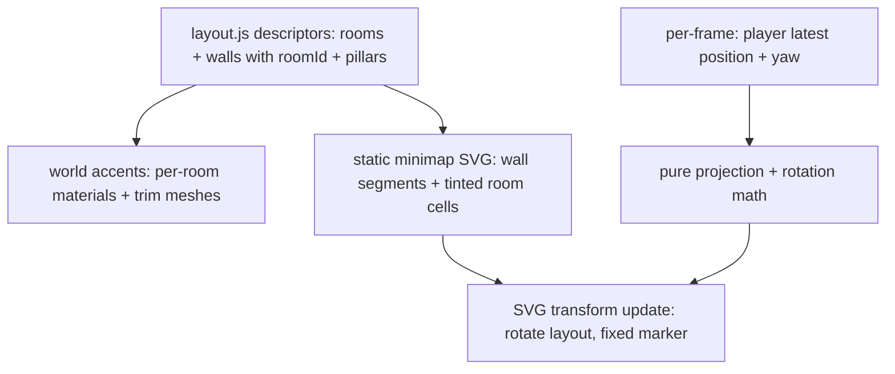

# Wayfinding - Plan

## Goal Capsule

- **Objective:** Give the player constant, glance-fast knowledge of where they are — a player-only corner minimap plus a distinct accent color per corner room — without revealing any enemy information. This plan owns wayfinding only; the armory loop (weapons + pickups) and killfeed follow as separate plans in an agreed sequence.
- **Product authority:** The Product Contract governs product behavior; the Planning Contract governs mechanism within it.
- **Stop conditions:** If the U1 spike shows no four-hue palette reads under the fog, stop and revisit the accent approach with the owner rather than shipping illegible colors.
- **Execution profile:** Phased; each unit ends with a human play-check before the next begins. Color legibility and feel are human-validated.
- **Open blockers:** None.

---

## Product Contract

### Summary

Add a player-only wayfinding layer: a corner minimap of the room layout, rotating player-up, showing the player's position and facing — and give each corner room its own accent color in the world (trim, pillar accents, tinted surfaces), with the map's room cells tinted in the same colors. One glance at either the world or the map places the player instantly. No enemy information appears anywhere.

### Problem Frame

Playing the shipped rooms-and-corridors arena, the owner gets lost mid-match: "all walls look same." The arena plan required rooms distinguishable at a glance (docs/plans/2026-08-05-001-feat-rooms-and-corridors-arena-plan.md, R4) and delivered it through pillar-shape landmarks only — which do not read in play. Disorientation breaks the hunt rhythm the arena was built for: a player who cannot say where they are cannot plan an ambush route. This plan delivers what that requirement intended.

### Key Decisions

- KD1. **Player-only map intel** — chosen over sound pings and full bot positions (session-settled: user-directed — the map must not hand the player the through-wall knowledge the arena work removed from bots). Governs R1, R8.
- KD2. **Minimap and room identity together, sharing one color language** — chosen over map-only, colors-only, and compass/monochrome variants (session-settled: user-directed — picked from visual sketches; the halves multiply: world accent and map tint make location pre-attentive). Governs R4, R5.
- KD3. **Player-up rotation** — chosen over fixed-north (session-settled: user-directed — the map always matches what is in front of the player; no mental rotation). Governs R3.
- KD4. **Full layout visible from match start** — no fog-of-war or exploration reveal (session-settled: user-approved — one small map; hiding it is ceremony). Governs R2.
- KD5. **Accents stay within the existing visual style** — no texture/art pass and no layout or collider change; thin visual-only accent meshes and per-room material tints are in scope (session-settled: user-approved — clarified at the plan scoping gate). Governs R5, R6.

### Requirements

**Minimap**

- R1. A corner minimap shows the room layout and the player's position and facing; it never shows any other entity.
- R2. The map depicts the entire real arena layout from match start, visible in full at every rotation, and always matches the physical arena.
- R3. The map rotates player-up: the player's facing points toward the top of the map; the player marker stays fixed while the layout turns.
- R4. Each map room cell carries the same accent as its room in the world; corridors and the central room render neutral on both surfaces.

**Room identity**

- R5. Each corner room has a distinct accent color applied through wall trim, pillar accents, and tinted surfaces — no new lights; a room without pillar geometry carries trim and surface tint only. The central room stays neutral and reads as the landmark reference.
- R6. Accents read at corridor distance under the current fog and lighting: a player mid-corridor can tell which room is ahead through its doorway.

**Guardrails**

- R7. The minimap is readable at a glance and never obscures the crosshair or center of the screen; it is present whenever normal play HUD is.
- R8. Wayfinding adds no enemy information in any state — alive, dead, respawning, or between matches.

### Key Flows

- F1. Reorientation
  - **Trigger:** Player exits a fight or respawn disoriented.
  - **Steps:** Peripheral accent color names the current room without a glance; a deliberate glance at the map gives facing and a route to the next room; player moves off with a plan.
  - **Covers:** R3, R4, R5.

### Acceptance Examples

- AE1. **Covers R1, R8.** Given bots alive in adjacent rooms, the minimap shows exactly one marker — the player's.
- AE2. **Covers R3.** Given the player turns 180°, the map layout rotates around the fixed player marker so their facing stays up.
- AE3. **Covers R5, R6.** Given the player stands anywhere in a corner room, that room's accent is visible without moving; from mid-corridor, the next room's accent is identifiable through the doorway.
- AE4. **Covers R4.** Given the player is in the yellow-accented room, the map cell under the player marker is yellow.

### Success Criteria

- Paused at any random mid-match moment, the owner can name the room they're in and point toward any named other room without hesitation — the "all walls look same" confusion is gone.
- Hunt-and-ambush pacing is untouched: no new enemy information, and the owner reports no change in stalking tension.
- No visible frame cost: ~60fps at max bots holds with the map rendering.

### Scope Boundaries

- No enemy positions and no sound pings on the map — pings are a recorded future candidate, not scope.
- The armory loop (weapons + pickups) and the killfeed — next plans in the agreed sequence, not this one.
- No texture/art pass, no layout or collider changes — accents only, per KD5.
- The bot-walks-backward-toward-player defect — a separate debug pass, starting with a failing test.

<!-- ce-section: work-relationships -->
### How This Work Fits Together

This plan owns wayfinding. The owner chose a three-plan sequence; the relationships below are current understanding, not a committed roadmap.

- Armory loop (weapon variety delivered as map pickups, one coherent feature) — agreed next plan; enabled by rooms giving item placement meaning; independent of this plan.
- Killfeed (match presentation) — agreed third plan; independent and small.
- Sound pings on the map — future candidate that would extend this plan's minimap; still to decide.
- Bot-vs-bot targeting, verticality — remain shelved from the arena plan.
- Bot walking-backward defect — routes to a debug pass, not a plan.

### Dependencies / Assumptions

- Verified: the HUD is DOM-based and shows only health, score, and crosshair states; bottom-right is the only free corner (fps counter top-left, score top-right, health bottom-left).
- Verified: the arena is one descriptor dataset — rooms, doorways, walls, pillars, spawn points (src/arena/layout.js) — consumed by both physics and render. Room entries carry axis-aligned bounds directly usable as map cells; wall entries carry no room ownership yet (U2 adds it); corridors exist only as wall segments, not as area descriptors — the map draws wall segments so corridors render without new data.
- Verified: walls and pillars share one material instance each (src/render/arenaMesh.js); the SE room has no pillar; lighting is one sun plus hemisphere ambient; fog is pale blue (0xa8bed6) spanning 20–60 units with real sightlines up to ~36 units. Accent hues must avoid the fog color and stay distinguishable through it.
- Verified: the codebase's screen-rotation precedent is inline SVG plus a CSS rotate transform (damage indicator), driven by pure exported math with DOM-free tests; no canvas 2D exists; unit tests run in plain Node with no DOM.

### Sources / Research

- src/ui/hud.js, src/main.js — HUD conventions, per-frame update site, simRunning gating, DOM paint-order overlay behavior.
- src/arena/layout.js — descriptor dataset the map renders from and U2 extends.
- src/render/arenaMesh.js, src/render/scene.js — shared materials, lighting rig, fog constants.
- src/render/feedback.js — the SVG + CSS-rotation overlay precedent the minimap mirrors.
- src/sim/movement.js — the sim forward basis (sin/cos of yaw) the map rotation must build on.
- docs/solutions/logic-errors/strafe-direction-camera-basis-mismatch.md — the yaw-basis bug class the rotation tests guard against.
- docs/plans/2026-08-05-001-feat-rooms-and-corridors-arena-plan.md — R4 (the legibility requirement this plan fulfills) and KD4/KTD8 (style and lighting constraints inherited here).

---

## Planning Contract

Product Contract preservation: changed — R5's "subtle light tint" became tinted surfaces with no new lights (real per-room lights bleed through open-topped walls or cost five cube shadow maps against the 60fps gate); the central room resolved to neutral (was an Outstanding Question); KD5 clarified to allow visual-only accent meshes while forbidding layout/collider change; R2 gained "visible in full at every rotation"; R4 gained the neutral-corridor rule. All user-approved at the scoping gate. Outstanding Questions resolved in place (corner, tint mechanism, central hue).

### Key Technical Decisions

- KTD1. **The minimap is inline SVG rotated by a CSS transform** — built once from the layout descriptors, updated per frame; a circular, diagonal-fit frame keeps the whole layout visible at every rotation; bottom-right corner; no CSS transition on the transform (transitions add easing lag at flick speeds). Mirrors the damage-indicator precedent; the repo has no canvas 2D and adds none. Cites R2, R3, R7.
- KTD2. **Rotation and projection are pure exported functions built on the sim forward basis** (sin/cos of yaw), reading the player's latest non-interpolated transform exactly as the camera does; the camera's +π yaw correction is not reused — it corrects a THREE camera convention unrelated to top-down maps. Tests assert screen-space outcomes, per the strafe-direction learning. Cites R3.
- KTD3. **Accents are per-room material tints on existing walls and pillars plus thin visual-only trim meshes; the tint is surface/emissive, zero new lights** (session-settled: user-approved — chosen over per-room point lights: they bleed through open-topped walls or need five cube shadow maps against the 60fps gate). Governs R5; cites R6.
- KTD4. **Wall entries gain an explicit room/space ownership field in the layout dataset** — additive, consistent with the ids rooms/doorways/pillars already carry, avoiding floating-point boundary classification at consumption time; corridor walls stay neutral. Cites R2, R4, R5.
- KTD5. **Four colorblind-aware accent hues; the central room stays neutral** (session-settled: user-approved) — hues avoid the fog's pale blue, differ in lightness as well as hue, and are validated in-engine at corridor distance under fog before the map tints are wired. Pillar shapes remain the secondary identity channel. Governs the palette under R4–R6.
- KTD6. **The minimap mounts into the app container alongside the HUD, before the shell screens, and updates inside the per-frame simRunning block** — overlay coverage and freezing in START/PAUSED/RESULTS fall out of existing DOM paint order with no new visibility logic; while dead, the map stays present under the death tint. Cites R7, R8.

### High-Level Technical Design

### Risks

- Palette legibility under fog is the load-bearing unknown — U1 gates the rest; the stop condition covers a no-viable-palette outcome.
- Two render tests assert exact mesh counts and "untextured" state — U3 updates them deliberately, never silently.
- The rotation-basis bug class looks correct in review and fails on screen — KTD2's screen-space tests are the guard, not code reading.

---

## Implementation Units

### U1. Palette and accent-mechanism spike (in-engine, throwaway)

- **Goal:** Prove four fog-safe, colorblind-distinguishable hues and the material-tint mechanism before any production code.
- **Requirements:** R5, R6; settles KTD5's palette and KTD3's mechanism in practice.
- **Dependencies:** None.
- **Files:** Scratch only — temporary hue overrides in a local branch of src/render/arenaMesh.js; nothing lands. The verdict (four hex values + chosen tint mechanism) is recorded in this plan by the implementer.
- **Approach:**
  1. Temporarily tint one room's walls/pillars via a cloned material; view from mid-corridor under fog at ~30 units.
  2. Cycle candidate hues (warm-leaning, no pale blue, lightness-separated); screenshot; run a colorblind simulation on the screenshots.
  3. Confirm the stats overlay shows no frame cost.
- **Execution note:** Owner eyeballs the candidates — color legibility is human-validated. Delete all spike edits after recording the verdict.
- **Test scenarios:** Test expectation: none — throwaway spike; findings become U3 constants.
- **Verification:** Owner confirms the four hues read at corridor distance under fog and survive the colorblind simulation.

**Verdict (recorded, spike deleted):**

- **Palette** — Okabe-Ito colorblind-safe subset (no blue member, avoids the fog hue):
  - `nw`: `#e69f00` (amber)
  - `ne`: `#d55e00` (vermillion)
  - `se`: `#cc79a7` (reddish-purple)
  - `sw`: `#009e73` (teal)
  - Verified pairwise-distinguishable under simulated protanopia, deuteranopia, and tritanopia (Machado/Oliveira/Fernandes matrices) — minimum pairwise RGB distance 51.3 (se/sw, deuteranopia), no pair collapses.
- **Mechanism** — per-room `MeshStandardMaterial` instances (surface color, `roughness: 0.85`, no emissive, no new lights) keyed by wall/pillar ownership; confirmed via in-engine raycast that assigned hues render exactly as specified, with no measurable frame-cost difference against an untinted baseline (~38-39fps in this sandboxed/software-rendered headless environment either way; real-hardware 60fps confirmation deferred to U5 per the Verification Contract).
- **Scope correction found and owner-approved:** wall/pillar tint alone does **not** read at true mid-corridor distance for 3 of 4 corner rooms (R6/AE3's actual bar). A raycast straight down each corridor showed NW's sightline luckily lands on its own pillar (37u, reads fine — 42% fog blend), but NE/SE/SW's sightlines thread the doorway gap straight through to the room's *far wall* (46.5u, 66% fog blend) — at which point hue stops mattering (confirmed by testing NW's own proven-good amber in SW's slot: still unreadable at 46.5u). **Fix, confirmed working:** U3's trim strips must reach a little past the doorway threshold toward the corridor side (not sit flush on the room-boundary wall face only) — a test stub spanning SW's doorway at the threshold plane cut the hit distance from 46.5u to 30.3u (26% fog blend) and read clearly. This is still within KD5 (visual-only accent mesh, no collider/layout change) but is a slightly larger U3 scope than "trim on room-boundary walls" alone implied — U3's approach below is updated accordingly.

Spike edits (`src/render/arenaMesh.js` palette-cycling + trim-stub test, `src/main.js` debug teleport/raycast hooks) fully removed after this verdict was recorded.

### U2. Room ownership in the layout dataset

- **Goal:** Walls know their room; the dataset carries everything both accent passes consume.
- **Requirements:** R2, R4, R5; implements KTD4.
- **Dependencies:** None (parallel with U1).
- **Files:** src/arena/layout.js, test/arena/layout.test.js.
- **Approach:** Add the ownership field to each wall entry at construction (room walls carry their room id; corridor and spoke walls carry their space id); no positions, sizes, or colliders change. Structural change only — its own commit, no behavior mixed in.
- **Test scenarios:**
  - Every wall sitting on a room's boundary carries that room's id; every corridor/spoke wall carries a non-room space id.
  - No wall entry is unowned; ids reference existing rooms/spaces.
  - Physics consumption is unchanged: collider count and positions identical before and after (existing arena tests stay green untouched).
- **Verification:** `npm test` green with no changes to arena physics tests.

### U3. World accents

- **Goal:** Corner rooms wear their colors; the world half of AE3 is real.
- **Requirements:** R5, R6; implements KTD3, consumes KTD4/KTD5.
- **Dependencies:** U1 (palette + mechanism verdict), U2 (ownership field).
- **Files:** src/render/arenaMesh.js, test/render/arenaMesh.test.js.
- **Approach:**
  1. Replace the single shared wall/pillar materials with per-room instances keyed by the ownership field; corridor walls keep the neutral material.
  2. Add thin trim strips (visual-only, no colliders) along room-boundary walls, reaching slightly past each doorway threshold toward the corridor side (U1 verdict: wall tint alone doesn't read at true mid-corridor distance for rooms without an on-axis pillar — the corridor-facing trim is what closes that gap). SE gets trim + surface tint only (it has no pillar; adding one is a layout change, out of scope).
  3. Apply the U1 palette; central room stays neutral.
  4. Update the exact mesh-count and untextured assertions deliberately to the new expected shape.
- **Test scenarios:**
  - Walls owned by a corner room get that room's material; corridor walls get the neutral material (FAKE_ARENA extended with owned walls).
  - Trim mesh count equals room-boundary wall count; trim meshes carry no physics.
  - SE room produces trim and tint but no pillar accent; central room produces no accent.
  - Updated count assertion: children = ground + walls + pillars + trim, exact.
- **Verification:** `npm test` and `npm run build` green; owner walks the map — each corner room names itself by color at corridor distance (AE3 live).

### U4. Minimap

- **Goal:** The rotating player-only map, mounted and live.
- **Requirements:** R1–R4, R7, R8; implements KTD1, KTD2, KTD6.
- **Dependencies:** U2 (ownership field for neutral-corridor drawing); U3 only for final cell tints (structure can proceed in parallel after U2).
- **Files:** src/ui/minimap.js (new: pure projection/rotation math + SVG builder + mount), src/main.js (mount alongside HUD; per-frame update in the simRunning block), test/ui/minimap.test.js.
- **Approach:**
  1. Pure math first: world→map projection normalized against the floor extent, and yaw→rotation built on the sim forward basis (KTD2) — exported, DOM-free.
  2. SVG builder renders wall segments top-down plus tinted room-cell rects from the descriptors, once; corridors neutral (R4).
  3. Circular diagonal-fit frame in the bottom-right; fixed centered marker; per-frame update sets one rotate transform from the player's latest yaw — no CSS transition.
  4. Mount into the app container before shell screens are created (KTD6) — no visibility logic.
- **Execution note:** Test-first for the math module, including the screen-space regression the strafe-direction learning prescribes.
- **Test scenarios:**
  - Covers AE2: facing yaw θ, a world point directly ahead of the player projects above the marker for θ = 0, π/2, π, and an arbitrary yaw — screen-space assertions, not internal consistency.
  - Covers AE4: the cell-lookup helper returns the room whose bounds contain the player, and its tint matches that room's palette entry; returns neutral in a corridor.
  - Projection maps the four floor corners inside the frame at every rotation (diagonal-fit invariant, R2).
  - Marker output is identical whether bots are alive or not — the module's input signature admits only the player transform and static layout (AE1 by construction).
  - Rotation input uses latest yaw: math is continuous across large per-frame yaw deltas (no wrap/smoothing artifacts).
- **Verification:** `npm test` green; owner plays — map rotates with flicks without lag, whole layout always visible, marker's cell matches the room they're standing in (AE2/AE4 live).

### U5. Live-play validation and tuning

- **Goal:** The success criteria hold in real play.
- **Requirements:** R6, R7; Success Criteria gate; AE1, AE3 confirmed live.
- **Dependencies:** U3, U4.
- **Files:** Tuning-level touches only (hue nudges in the U3 palette, map size/opacity in src/ui/minimap.js).
- **Approach:** Owner plays several full matches: random-pause room-naming test, fog-distance legibility, death/pause/results behavior, stalking-tension check, stats-overlay fps at max bots. Adjust one knob at a time.
- **Test scenarios:** Test expectation: none — validation and tuning; behavioral coverage landed in U2–U4.
- **Verification:** All three Success Criteria checked by the owner; ~60fps confirmed; no test or build regressions after tuning.

---

## Verification Contract

| Gate | Command / act | Applies to |
|---|---|---|
| Unit tests | `npm test` (vitest, Node env — no DOM in tests) | U2–U4, every commit |
| Build | `npm run build` | U3, U4 |
| Rotation regression | Screen-space math assertions in test/ui/minimap.test.js | U4 |
| Render parity | Deliberately updated exact-count assertions in test/render/arenaMesh.test.js | U3 |
| Live play-check | Owner runs `npm run dev` and plays the unit's named scenario | U1, U3, U4, U5 |
| Performance | Stats overlay ~60fps at max bots | U1, U5 |

---

## Definition of Done

- R1–R8 hold in the shipped game; AE1–AE4 demonstrated (AE2/AE4 by tests plus live check, AE1/AE3 by construction plus live check).
- `npm test` and `npm run build` green; the two deliberately-updated render assertions are the only test-shape changes.
- Owner has validated each unit's play-check, including U5's random-pause room-naming test and the stalking-tension check.
- ~60fps at max bots with the map rendering.
- U1 spike edits fully removed; no dead code or stale comments from the shared-material era.
- CONCEPTS.md and README stay accurate; the plan's palette verdict is recorded in U1.
