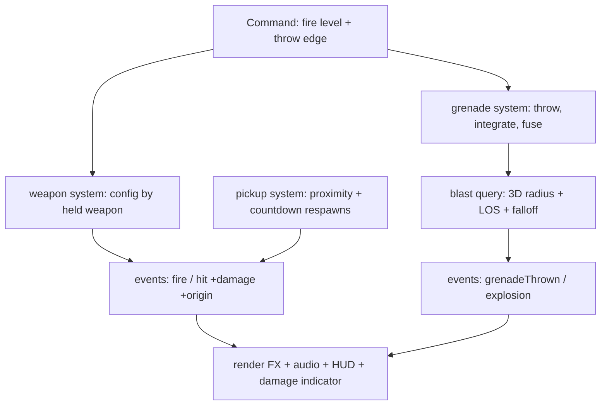
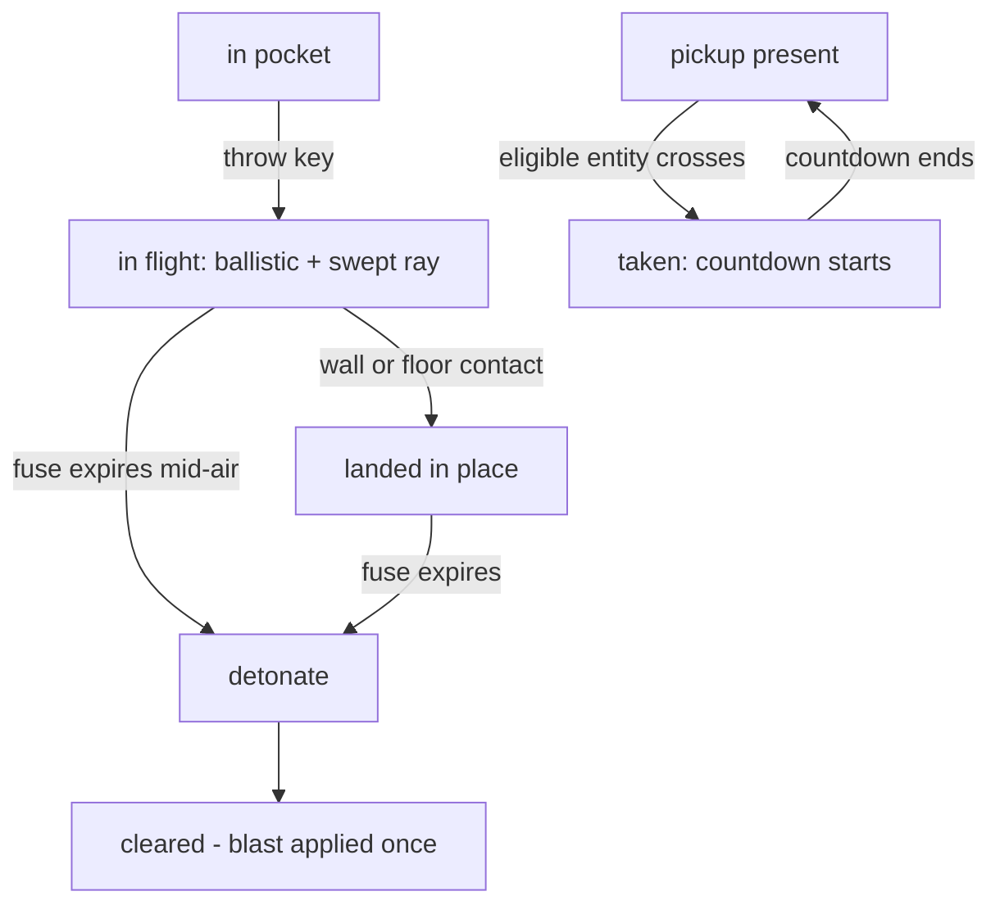

# Armory Loop - Plan

## Goal Capsule

- **Objective:** Add weapon variety delivered as map pickups — a machine gun and grenades — so controlling rooms matters and map knowledge deepens, without breaking hunt-and-ambush pacing. This plan owns the armory loop only; the killfeed follows as the third plan in the agreed sequence.
- **Product authority:** The Product Contract governs product behavior; the Planning Contract governs mechanism within it.
- **Stop conditions:** Any change to product scope goes back to the owner. If MG asset sourcing fails, ship the placeholder and record the gap — do not block the loop on art.
- **Execution profile:** Phased; each unit ends with a human play-check before the next begins. Weapon feel, grenade arc, and pacing are human-validated.
- **Open blockers:** None.

---

## Product Contract

### Summary

A machine gun and grenades enter the game as map pickups. The machine gun auto-swaps into the gun slot and sprays while the trigger is held until its ammo runs dry, then the infinite pistol returns; grenades live in a separate pocket with their own throw key, arcing into rooms with area damage that can kill a cluster. Bots grab the machine gun in passing and spray back; grenades are the player's alone. Pickups respawn on a timer, so knowing and holding the spawn rooms stays valuable all match.

### Problem Frame

Combat is a single infinite pistol: every fight plays the same, and rooms are places to hide in, not assets to control. The owner's chosen fantasy is spraying with a machine gun and killing multiple bots with one grenade. Delivering weapons as pickups ties both to the map: the central room becomes a prize, corner rooms stock the pocket, and the hunt gains a second layer — hunting positions, not just enemies. The grenade is also the learning milestone: the sim's first projectile (arc, fuse, area damage) after a hitscan-only history.

### Key Decisions

- KD1. **Machine gun and grenade are the two archetypes** — chosen over shotgun/rocket/rifle alternatives (session-settled: user-directed — the owner's stated fantasy: spray, and multi-kill blasts). Governs R1, R3.
- KD2. **Gun slot plus grenade pocket** — chosen over a shared special slot and over full arsenal switching (session-settled: user-directed — both fantasies coexist and no weapon-switch input is needed: the MG auto-equips and auto-reverts, grenades have their own key). Governs R1, R2, R3.
- KD3. **Bots use the machine gun only, acquired in passing** — chosen over full symmetry, player-only pickups, and deliberate gun-hunting variants (session-settled: user-directed — contention where it's cheap; map knowledge usually wins the race; bot grenade AI deferred). Governs R7.
- KD4. **Machine gun spawns in the central landmark room; grenades in corner rooms; taken pickups respawn on a timer** (session-settled: user-approved — the landmark becomes the prize; room control stays live all match). Governs R5, R6.
- KD5. **Grenade damage is honest** — it hits everyone in radius including the thrower, kills credit the thrower, and walls block it: damage requires line of sight from the blast center (session-settled: user-approved — arcs over open-topped walls stay legal; through-wall damage never happens). Governs R4.
- KD6. **Death drops the machine gun** — the carrier's MG and ammo are stripped on death, and the taken pickup's respawn timer is the gun's only return path; the player's grenade pocket survives in-match respawn (session-settled: user-approved — killing the carrier genuinely removes the gun from play). Governs R13.

### Requirements

**Weapons**

- R1. The machine gun is rapid-fire hitscan spray — it fires continuously while the trigger is held, with higher fire rate and spread than the pistol and finite ammo; it auto-equips on pickup and auto-reverts to the pistol when dry.
- R2. The pistol remains the infinite, always-available fallback; its current click-per-shot feel is unchanged.
- R3. The grenade throws on its own key, arcs under gravity, stops where it first lands, and explodes after a fuse with area damage falling off from the blast center; one blast can kill multiple entities.
- R4. Blast damage applies to every entity within a 3D radius that has line of sight to the blast center, the thrower included; kills credit the thrower; walls and pillars block it.

**Pickups**

- R5. Pickups are visible items at fixed spots: the machine gun in the central landmark room, grenade pickups in corner rooms.
- R6. Moving over a pickup takes it when the taker can use it — a full grenade pocket leaves the pickup in place; a taken pickup respawns after a delay.
- R7. A bot takes the machine gun only when its path happens to cross it, sprays at the weapon's real rate while it holds it, then reverts when dry; grenade pickups are player-only.
- R8. Match reset returns every entity to the pistol, empties the grenade pocket, restores all pickups, and clears every in-flight grenade and pending blast.
- R13. Death strips the carrier's machine gun and ammo — bot or player; the player's grenade pocket survives in-match respawn.

**Presentation and information**

- R9. The HUD shows machine-gun ammo while it is held and the grenade count when above zero, joining the bottom-left status cluster (the minimap owns bottom-right); nothing else joins the HUD in this plan.
- R10. The machine gun sounds distinct from the pistol, and the viewmodel shows the held weapon.
- R11. A grenade in flight and its explosion are visible and audible — under hunt pacing, the blast sound is information for everyone who hears it. Damage-direction feedback for a blast points at the blast center, never at the thrower's live position.

**Pacing guard**

- R12. Hunt-and-ambush pacing holds: ammo capacity, spread, damage, grenade count and radius, and respawn delays are tuned so the pistol stays viable and constant contact does not return.

### Key Flows

- F1. The gun run
  - **Trigger:** Player decides to arm up.
  - **Steps:** Route to the central room from map knowledge; find the machine gun or find it taken; spray while ammo lasts; revert to pistol; plan the next run around the respawn delay.
  - **Covers:** R1, R5, R6.
- F2. The flush
  - **Trigger:** A bot holds a room the player wants.
  - **Steps:** Player arcs a grenade through the doorway without exposing themselves; the blast kills or flushes everyone near it; player follows up with the gun.
  - **Covers:** R3, R4.
- F3. Bot with the machine gun
  - **Trigger:** A bot's patrol or chase crosses the machine-gun spawn.
  - **Steps:** Bot equips it; its next engagement sprays at the MG's rate; when dry — or when the bot dies — the gun is gone until the pickup respawns.
  - **Covers:** R7, R13.

### Acceptance Examples

- AE1. **Covers R1, R2.** Given the player takes the machine gun and holds the trigger, then it fires continuously with visible spread and the ammo readout counts down; at zero, the pistol returns with no input, back on click-per-shot.
- AE2. **Covers R3, R4.** Given two bots near a grenade's blast point with clear line of sight to it, then both take lethal damage and the thrower is credited twice; a thrower inside the radius takes damage too; a bot behind a wall the same distance away takes nothing.
- AE3. **Covers R6, R7, R13.** Given a bot walks over the machine-gun spawn, then the bot holds it and the arriving player finds the spot empty; killing that bot does not drop the gun — it returns only when the pickup respawns.
- AE4. **Covers R8.** Given play-again with a grenade mid-air, then the new match starts with every entity on the pistol, the pocket empty, all pickups present, and no explosion from the old match.
- AE5. **Covers R9.** Given the player holds the pistol with no grenades, then no ammo or grenade readout is shown; picking either up shows its counter in the bottom-left cluster.

### Success Criteria

- The gun run becomes a habit: the owner routes through the central room deliberately, and finding the gun taken changes their plan — validated by play.
- At least one earned multi-kill grenade moment per few matches; it feels like skill, not spam.
- The pistol never feels pointless; matches do not revert to constant contact.
- ~60fps at max bots holds with pickups, projectiles, and blasts active.

### Scope Boundaries

- The killfeed — plan three of the agreed sequence (grenade multi-kills will make it richer).
- Bot grenade-throwing AI and deliberate pickup-seeking — deferred, per KD3.
- Grenade bounce physics — v1 stops where it lands (R3); bounce is a tuning follow-up.
- Weapon-switch input, full arsenal, additional archetypes — excluded by KD2; future candidates.
- Health/armor pickups — future candidate the pickup system enables; not this scope.
- No arena geometry or layout changes.

<!-- ce-section: work-relationships -->
### How This Work Fits Together

This plan owns the armory loop. Relationships below are current understanding, not a committed roadmap.

- Killfeed (match presentation) — agreed third plan; independent, and enriched by grenade multi-kills via the extended hit-event contract (KTD1).
- Wayfinding (minimap + room accents) — separately planned, independent; HUD corners are allocated across both plans (R9).
- Health/armor pickups — enabled by this plan's pickup system; still to decide.
- Bot grenade AI and deliberate pickup-seeking — depend on this plan; still to decide.

### Dependencies / Assumptions

- Verified: weapon behavior is single and hardcoded — one hitscan path, flat 20 damage, one cooldown constant shared through one weapon-system instance; per-weapon parameterization is a structural change (src/sim/weapon.js, src/sim/health.js).
- Verified: fire input is strictly edge-triggered for player and bots — no held-trigger exists anywhere, and the bot fire cadence is a module constant (src/sim/bot/fsm.js `FIRE_INTERVAL_TICKS`), not a difficulty knob. Held-fire input and weapon-aware bot cadence are new work, not existing plumbing.
- Verified: the Command carries only fire and jump; `KeyG` and `KeyQ` are unbound; the fire latch pattern (edge-triggered, framerate-independent) is the template for the throw key (src/sim/command.js, src/input/sampler.js).
- Verified: the sim has no dynamic physics bodies — all movement is hand-integrated over kinematic bodies, and all Rapier use is read-only raycasts; the health system's countdown respawn timer (`respawnTicksRemaining`, ticked at world scope every tick) is the proven timer pattern, with an explicit clear hook in match reset.
- Verified: the viewmodel hot-swaps models (`setModel`); the shared test rig exists at test/support/rig.js (combat tests still carry a duplicated hand-rolled rig — tidy target); parked bots sit at y=-100 below the central room, alive in the entity store.
- Asset gap (verified): no machine-gun model and no explosion sound exist in-repo — source one gun GLB and one explosion sample (CREDITS.md records the pattern); fallbacks are a retinted pistol and a layered gunshot burst.

### Sources / Research

- src/sim/weapon.js, src/sim/health.js, src/sim/world.js — hitscan path, damage application, entity store and events the armory extends.
- src/sim/command.js, src/input/sampler.js, src/main.js — input path for held-fire and the throw key; event-consumption loop.
- src/sim/bot/fsm.js, src/sim/bot/difficulty.js — bot fire gating the MG cadence must thread through.
- src/sim/lineOfSight.js, src/arena/layout.js, src/shell/matchEnd.js — blast occlusion, pickup descriptors, match reset.
- src/render/weaponView.js, src/render/impacts.js, src/audio/gunshots.js — viewmodel swap, burst-effect pattern, sound-set generalization.
- docs/solutions/logic-errors/ — all three writeups constrain this work: countdown timers over absolute deadlines (retreat-survives-death), vector-rejection with `dot(result, desired) > 0` tests for any deflection math (obstacle-avoidance-reversal), and the verified yaw/pitch basis for throw direction (strafe-basis-mismatch).
- docs/plans/2026-08-05-001-feat-rooms-and-corridors-arena-plan.md — hunt-and-ambush pacing pillar and honest-LOS philosophy this plan extends to blasts.

---

## Planning Contract

Product Contract preservation: changed — R1 gained hold-to-fire (research found no held-trigger input exists; without it "sprays until dry" is unimplementable); R3 gained stop-where-it-lands; R4 gained the 3D-radius-plus-blast-LOS rule; R6 gained the can-use eligibility clause; R8 gained in-flight clearing; R9 gained bottom-left placement; R13 added (death drops the MG; pocket survives respawn); the Dependencies claim that bot fire "flows through existing knobs" was corrected. All user-approved at the scoping gate.

### Key Technical Decisions

- KTD1. **Per-weapon behavior resolves per entity per shot inside the one weapon system** — a weapon config (cooldown, spread, damage, ammo) looked up from the entity's held weapon; damage threads through the hit application, and hit events gain a damage amount and a damage-origin position. The extended event contract is what the damage indicator reads now and the killfeed reads in plan three. Cites R1, R2, R4, R11.
- KTD2. **Held-fire is a new Command level; the pistol keeps the edge-triggered latch.** The sampler tracks mouse down/up for the level; the existing one-click-one-shot path is untouched, and MG spread applies inside the fire resolution — one spread mechanism for player and bot MG alike, distinct from the bot's always-on aim spread. Cites R1, R2.
- KTD3. **The grenade is a hand-integrated ballistic point with a swept raycast per tick** — sim-owned position and velocity, gravity reused from the movement system, wall contact drops it in place (R3), no dynamic physics body and no new collider. Matches the sim's purity and determinism conventions; every API involved is already exercised in-repo, so no spike unit is needed. Throw direction derives from the verified yaw/pitch basis the hitscan already uses. Cites R3.
- KTD4. **The blast is a world-scope query: 3D distance with falloff, gated by line of sight from the blast center**, reusing the existing LOS helper without eye-height offsets; inactive parked entities are excluded and a test proves a central-room blast cannot touch them at y=-100. Governs R4's mechanism.
- KTD5. **Every armory timer is a countdown-remaining value ticked by an always-running world-scope loop** — grenade fuses and pickup respawns mirror the health system's respawn-timer shape, never absolute tick deadlines; each gets an explicit clear hook wired into match reset in the same commit that introduces it (session-settled lineage: the repo's retreat-survives-death learning). Cites R8, R13.
- KTD6. **Bot fire cadence becomes weapon-aware** — the bot's intent-to-fire interval reads the held weapon's config instead of the hardcoded module constant; MG spread composes with the bot's aim spread and is tuned with that composition in mind. Cites R7.
- KTD7. **Pickups are a sibling sim system with a parallel state accessor** — fixed positions from a new layout descriptor array; persistent render meshes toggle visibility on take/respawn (the bot-mesh idiom, not effect pooling); collection runs inside the per-entity command loop so dead and parked entities are excluded by construction; same-tick ties resolve in command order (player first). Cites R5, R6, R7.
- KTD8. **Audio generalizes to named sound sets** — the gunshot pool gains a per-weapon set (MG placeholder: pitched existing samples until an asset lands); the explosion is a single one-shot positional buffer with its own louder/farther falloff, no pool. Cites R10, R11.

### High-Level Technical Design

### Risks

- A bot with the MG could be less lethal than with the pistol (spread composition) — U6 tunes with the composition explicit; the risk is inverted feel, not correctness.
- The held-fire input change touches the pistol's path — R2's unchanged feel is guarded by keeping the edge path intact and by existing combat tests staying green untouched.
- Blast LOS at wall tops: a blast centered near an open wall's lip can clip the edge — test scenarios pin both sides (over-the-wall legal, through-the-wall blocked) at explicit geometry.
- Asset sourcing may fail — placeholders ship first; the stop condition covers art, not the loop.

---

## Implementation Units

### U1. Per-weapon foundation and event contract

- **Goal:** The sim supports per-weapon behavior and richer hit events, with zero behavior change — the pistol plays identically.
- **Requirements:** R2; implements KTD1's structure; enables everything after.
- **Dependencies:** None.
- **Files:** src/sim/weapon.js, src/sim/health.js, src/sim/world.js (entity fields `heldWeapon`/`ammo`/`grenadeCount`, render-state passthrough, event shapes), src/render/feedback.js + src/main.js (indicator reads damage-origin), test/support/rig.js, test/sim/combat.test.js, test/sim/world.test.js.
- **Approach:**
  1. Structural pre-step, own commit: fold test/sim/combat.test.js's hand-rolled rig into test/support/rig.js (its own doc comment says it exists for this) — no behavior change.
  2. Weapon config registry (pistol, machinegun) resolved per entity from `heldWeapon` inside `resolveFire`; cooldown/damage flow from the config; `applyHit` takes damage as a parameter.
  3. Hit events gain `damage` and a damage-origin position; the damage indicator consumes the origin (identical value for hitscan — shooter position).
- **Execution note:** This unit is refactor-shaped: prove no behavior change by the existing combat suite passing with only deliberate signature updates.
- **Test scenarios:**
  - Pistol config produces today's exact numbers: 20 damage, cooldown 6, zero spread — full existing combat suite green.
  - An entity with `heldWeapon: 'machinegun'` resolves the MG config (cooldown/damage/spread differ) — unit-level, no input path yet.
  - Hit event carries damage and origin; indicator math yields the same angle as before for hitscan hits.
  - Entity defaults: new fields present on `createEntity` and passed through `getRenderState` uninterpolated.
- **Verification:** `npm test` green with no unexplained assertion changes; owner plays one match — nothing feels different.

### U2. Machine gun, held fire, and new inputs

- **Goal:** The MG exists and sprays; all new input lands; the pistol is untouched.
- **Requirements:** R1, R2, R9 (ammo readout), R10; implements KTD2, KTD6, KTD8's MG set; advances AE1.
- **Dependencies:** U1.
- **Files:** src/sim/command.js (fire level + `throwGrenade` edge), src/input/sampler.js (mouseup tracking, `KeyG` throw latch), src/main.js (mouse listeners, wiring), src/sim/weapon.js (spread jitter, ammo drain, auto-revert), src/sim/bot/fsm.js (weapon-aware fire cadence), src/ui/hud.js (`formatAmmo`, `formatGrenadeCount`, bottom-left cluster elements), src/audio/gunshots.js (named sound sets), src/render/weaponView.js + src/render/modelAssets.js (model swap on heldWeapon; placeholder model), test/sim/combat.test.js, test/sim/botAI.test.js, test/input/sampler.test.js, test/ui/hud.test.js, test/audio/gunshots.test.js.
- **Approach:**
  1. Command gains a held-fire level alongside the existing edge latch; sampler tracks mousedown/mouseup; the throw key lands now as an edge latch (consumed in U4).
  2. `resolveFire` fires on level for the MG, on edge for the pistol; spread jitters the direction per shot; ammo decrements per shot; at zero, `heldWeapon` reverts to pistol.
  3. Bot cadence: intent-to-fire interval reads the held weapon's config (KTD6); bots hold fire-level while attacking with the MG.
  4. HUD: both formatters and elements land (grenade count reads zero until U4); conditional visibility per R9.
- **Execution note:** Test-first for the input path — the held-level vs edge-latch distinction is exactly where a pistol regression would hide. For the play-check, grant the player the MG at spawn behind a temporary debug flag; U3 removes it.
- **Test scenarios:**
  - Covers AE1: holding fire with the MG emits shots each cooldown window and drains ammo; at zero the pistol returns and held fire produces nothing further without a new click.
  - Pistol regression: held mouse with the pistol fires exactly once (edge semantics unchanged).
  - MG spread: consecutive shots from a fixed pose produce distinct directions bounded by the spread constant.
  - Bot with MG fires at the MG cadence; bot with pistol at today's cadence (interval read from config, not the old constant).
  - `formatAmmo`/`formatGrenadeCount` hide at pistol/zero and render counts otherwise.
  - Audio: MG key selects the MG sound set; variant cycling still avoids repeats.
- **Verification:** `npm test` and `npm run build` green; owner sprays with the debug-granted MG — feel check on rate/spread; pistol feels identical.

### U3. Pickup system

- **Goal:** Weapons live on the map; the loop's economy runs.
- **Requirements:** R5, R6, R7, R8, R13; implements KTD5 (pickup timers), KTD7; advances AE3, AE4, AE5.
- **Dependencies:** U2.
- **Files:** src/arena/layout.js (`PICKUPS` descriptor array), src/sim/pickups.js (new), src/sim/world.js (collection in the command loop; death strips MG), src/shell/matchEnd.js (`resetAll` + entity armory fields in the reset loop), src/main.js (system wiring, remove the U2 debug grant), src/render/pickupMeshes.js (new: persistent meshes, visibility toggle), test/arena/layout.test.js, test/sim/pickups.test.js (new), test/shell/matchEnd.test.js.
- **Approach:**
  1. Descriptors: MG spot in the central room, one grenade spot per corner room, typed and room-tagged, validated like spawn points.
  2. `createPickupSystem`: proximity collection inside the per-entity command loop (KTD7 exclusions by construction); eligibility per R6 (full pocket doesn't consume; MG re-pickup refills and consumes); countdown respawns per KTD5; same-tick tie → command order.
  3. Death hook: stripping the carrier's MG and ammo joins the existing death path (R13); the pickup's countdown, started at take, is the only return.
  4. Reset: `resetAll` restores pickups; entity armory fields join the reset loop.
- **Test scenarios:**
  - Covers AE3: bot crosses the MG spot → holds it; killing the bot does not restore the pickup early; countdown restores it on schedule.
  - Covers AE5 (partial): grenade pickup at full pocket leaves the pickup present; after throwing one (stubbed count decrement), collection succeeds and consumes.
  - Same-tick contention: player and bot both in range on one tick → player takes it, pickup marked taken once, bot gets nothing.
  - Covers AE4 (partial): reset restores all pickups, zeroes pockets, reverts weapons — asserted through `resetMatch`.
  - Parked bot at y=-100 never collects (3D distance; runs only for command-receiving entities).
  - Respawn countdown ticks at world scope: a taken pickup respawns on time even if every entity died meanwhile.
- **Verification:** `npm test` green; owner plays the gun run (F1 live): find it, lose it to a bot, wait out the respawn.

### U4. Grenade

- **Goal:** The sim's first projectile: throw, arc, land, detonate, multi-kill.
- **Requirements:** R3, R4, R8 (in-flight clearing), R13 (pocket survives respawn); implements KTD3, KTD4, KTD5 (fuse); advances AE2, AE4.
- **Dependencies:** U2 (throw input), U3 (grenade pickups feed the pocket).
- **Files:** src/sim/grenades.js (new: ballistic integration, fuse countdown, blast query), src/sim/world.js (step wiring, events `grenadeThrown`/`explosion`), src/sim/lineOfSight.js (blast-center variant without eye-height offsets), src/shell/matchEnd.js (clear in-flight), src/main.js (event consumption), test/sim/grenades.test.js (new), test/sim/combat.test.js.
- **Approach:**
  1. Throw consumes the `throwGrenade` edge and one pocket count; initial velocity from the verified yaw/pitch basis (the hitscan direction formula) plus a fixed throw speed and upward bias.
  2. Integrate per tick with the movement system's gravity constant; swept raycast from previous to next position detects contact; contact drops the grenade in place (R3) — no bounce, no tunneling through 1-unit walls.
  3. Fuse is a world-scope countdown (KTD5); detonation runs the blast query (KTD4): 3D distance, LOS gate from blast center, linear falloff through the parameterized damage path; each hit credits the thrower (self-kill uncredited via the existing guard).
  4. Match reset clears in-flight grenades and pending blasts (R8).
- **Execution note:** Test-first throughout — this is pure sim math with no UI dependency, and the blast rule is the plan's most conditional logic.
- **Test scenarios:**
  - Covers AE2: two bots in radius with LOS die, thrower credited twice; a third bot behind a wall at equal distance takes nothing; a thrower inside the radius takes damage and gets no self-credit.
  - Arc: thrown grenade's y peaks then falls under gravity; lands within the swept ray's contact tolerance; never crosses a wall segment between ticks at maximum throw speed.
  - Fuse: denominated in sim ticks; a paused sim does not burn fuse; detonation fires exactly once.
  - Thrower dies mid-fuse → blast still resolves and credits the (dead) thrower.
  - Parked-bot immunity: a central-room blast leaves bots at y=-100 untouched (3D distance and LOS both fail).
  - Match end on a multi-kill blast tick resolves cleanly (events before match-end check); reset despawns a frozen mid-air grenade (AE4).
  - Pocket survives in-match respawn; empties only on match reset (R13/R8 boundary).
- **Verification:** `npm test` green; owner throws over a wall and through a doorway — arc reads believably, blast kills cluster, wall protects (AE2 live).

### U5. Presentation and assets

- **Goal:** The armory looks and sounds real: models, explosion, throw feedback.
- **Requirements:** R10, R11; completes KTD8.
- **Dependencies:** U2, U4.
- **Files:** public/assets/ (sourced MG GLB, explosion OGG), CREDITS.md, src/render/modelAssets.js, src/render/grenadeFX.js (new or folded into impacts: in-flight grenade mesh + explosion burst scaled from the impact-spark pattern), src/audio/gunshots.js (explosion one-shot), src/main.js (event → FX/audio wiring), test/render/modelAssets.test.js, test/audio/gunshots.test.js.
- **Approach:**
  1. Source a Quaternius gun GLB and a Kenney-style explosion sample; update CREDITS.md; placeholders stay until assets land (stop condition covers failure).
  2. Grenade in flight: small persistent mesh following the sim position; explosion: burst reusing the impact-spark pooling idiom, larger scale plus a brief light flash.
  3. Explosion audio: single positional buffer, louder/farther falloff than gunshots (R11's information role).
- **Test scenarios:**
  - Asset registry resolves the MG model and explosion sample paths; fallback paths hold when absent.
  - Explosion event triggers exactly one burst and one positional sound at the blast center.
  - Test expectation: none for visual look — owner-validated.
- **Verification:** `npm run build` green; owner watches a full flush — grenade visible in flight, blast audible across the map, MG looks like its own gun.

### U6. Balance and live-play validation

- **Goal:** The loop plays as designed at 60fps; the pacing guard holds.
- **Requirements:** R12; Success Criteria gate; F1–F3 confirmed live.
- **Dependencies:** U3, U4, U5.
- **Files:** Tuning constants across src/sim/weapon.js (MG config), src/sim/grenades.js (fuse/radius/falloff/speed), src/sim/pickups.js (respawn delays, pocket cap), src/sim/bot/fsm.js (cadence composition), affected tests (assertions relative to exported constants).
- **Approach:** Owner plays several full matches tuning one knob at a time: MG ammo/rate/spread/damage, grenade fuse/radius/carry cap, pickup respawn delays, bot MG cadence (watching for the spread-composition inversion). The pistol-viability and constant-contact checks are the gate.
- **Test scenarios:**
  - Tuning-touched tests stay green expressed relative to exported constants.
  - Test expectation: none for feel — owner-validated by design.
- **Verification:** All four Success Criteria checked by the owner across ≥3 matches; ~60fps at max bots with pickups and blasts active on the stats overlay.

---

## Verification Contract

| Gate | Command / act | Applies to |
|---|---|---|
| Unit + integration tests | `npm test` (vitest, shared rig in test/support/rig.js) | U1–U4, U6, every commit |
| Build | `npm run build` | U2, U5 |
| Pistol regression | Existing combat suite green with only deliberate signature updates | U1, U2 |
| Blast honesty | AE2 test trio (LOS kill / wall block / self-damage) in test/sim/grenades.test.js | U4 |
| Timer safety | Death-mid-fuse, pause-mid-fuse, and reset-clears-in-flight tests | U4 |
| Live play-check | Owner runs `npm run dev` and plays the unit's named scenario | every unit |
| Performance | Stats overlay ~60fps at max bots with pickups + blasts | U6 |

---

## Definition of Done

- R1–R13 hold in the shipped game; AE1–AE5 demonstrated (AE1/AE2 by tests plus live checks; AE3–AE5 by tests plus the U3/U5 play-checks).
- `npm test` and `npm run build` green; the combat-rig consolidation landed as its own structural commit.
- Owner validated F1 (gun run), F2 (flush), F3 (bot sprays) live, plus the U6 multi-match balance session.
- ~60fps at max bots with the full loop active.
- The U2 debug MG grant is removed; no dead code from the single-weapon era; CREDITS.md covers all sourced assets.
- CONCEPTS.md and README stay accurate (README's controls section gains the throw key).
