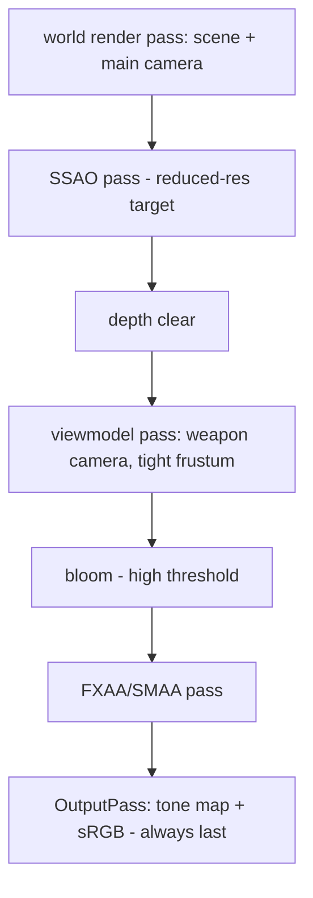

# Visual Fidelity - Plan

## Goal Capsule

- **Objective:** Make the arena read as a real game at first glance: textured surfaces, real weapon assets, bullet-impact decals, a clipping-free viewmodel, a skybox, and subtle post-processing — in the existing clean artificial style with the lighting rig untouched. This plan owns visual fidelity only; two parked defects route to a debug pass, not here.
- **Product authority:** The Product Contract governs product behavior; the Planning Contract governs mechanism within it.
- **Stop conditions:** If the U1 spike shows the composer cannot hold ~60fps even with SSAO at reduced resolution, ship without ambient occlusion (bloom-only) and record the gap rather than trading the frame rate. If asset sourcing fails, ship the current placeholders and record it — art never blocks the pass.
- **Execution profile:** Phased; each unit ends with a human play-check. Look and feel are human-validated.
- **Open blockers:** None.

---

## Product Contract

### Summary

Upgrade the game's surface quality without changing its identity: real texture materials on walls, floors, and pillars (room accents preserved on top), a sourced machine-gun model and real MG/explosion sounds replacing the shipped placeholders, bullet-impact decals that persist on surfaces, a viewmodel that never clips through walls, a clean sci-fi skybox, and restrained bloom plus ambient occlusion. Lighting, geometry, and gameplay stay exactly as they are.

### Problem Frame

The game now plays well but doesn't look the part: to a layperson — the recruiter or friend whose first three seconds are pure visuals — flat single-color walls, a machine gun that renders as a literal untextured box, a slowed-down pistol sample standing in for an explosion, and a gun that pokes through walls all read as "programmer demo," not "game." The mechanics have outgrown the presentation; this pass closes that gap.

### Key Decisions

- KD1. **Six-item scope: surface textures, real MG assets, impact decals, viewmodel fix, skybox, subtle post-processing** (session-settled: user-directed — the core four named from play experience, the add-ons chosen from offered candidates). Governs R1–R8.
- KD2. **The clean artificial-arena style is kept, not replaced** — no gritty overhaul, no dust/ambience, lighting rig untouched (session-settled: user-directed — "lighting is fairly good, no complaints"; the arena is deliberately artificial). Governs R1, R10.
- KD3. **First-person arms are declined** — heaviest effort-per-pixel item; recorded as a future candidate (session-settled: user-directed).
- KD4. **Decals persist with a cap; oldest fade as new ones land** (session-settled: user-approved — permanent holes grow unbounded over a match). Governs R5.
- KD5. **The skybox and fog harmonize, with license to retune the fog color** if the chosen sky needs it (session-settled: user-approved — the two blend at the horizon and are currently the same flat color). Governs R7.

### Requirements

**Surfaces**

- R1. Walls, floors, and pillars carry real texture materials — clean panels/metal/composite in the artificial style, not photoreal grunge.
- R2. Room accent colors stay readable on top of the textures: a corner room still names itself by hue at corridor distance under fog.

**Weapon assets**

- R3. The machine gun has a real sourced model in the viewmodel, replacing the placeholder box; CREDITS.md records it.
- R4. The MG firing sound and the grenade explosion are real sourced samples, replacing the pitched pistol buffers; the explosion keeps its louder, farther-carrying information role.

**Impact feedback**

- R5. Bullet hits leave decals on world surfaces — walls, pillars, trim, and floor — at the visible hit point, oriented to the surface; they persist through the match under a cap, fading only under cap pressure, with tightly clustered hits deduplicated; match reset clears them.

**Viewmodel**

- R6. The first-person weapon never visibly clips through world geometry, including when standing against or strafing along a wall.

**Backdrop and grading**

- R7. A skybox replaces the flat sky color and blends into the fog at the horizon without a visible seam.
- R8. Post-processing stays subtle: bloom on bright elements (muzzle flash, accent trim) and gentle ambient occlusion — it reads as polish, never as a filter.

**Guardrails**

- R9. ~60fps at max bots holds with textures, decals, skybox, and post-processing all active mid-firefight.
- R10. No geometry, collider, or layout changes, and the lighting rig — the sun, hemisphere ambient, shadow setup, and fog distances — is untouched; combat-effect lights (muzzle flash, explosion) may retune so their read is unchanged under bloom. Gameplay behavior is untouched.

### Acceptance Examples

- AE1. **Covers R5.** Given three spaced shots into a wall, then three decals appear at the visible hit points facing out of the surface; a held burst into one spot produces a few deduplicated decals, not one per round; past the cap, the oldest fade first; play-again clears them all.
- AE2. **Covers R6.** Given the player stands nose-to-wall and strafes along it, then no part of the gun renders inside the wall — and the muzzle flash still lights the wall and still blooms.
- AE3. **Covers R2.** Given textures applied, each corner room's accent hue is still identifiable from mid-corridor under fog.
- AE4. **Covers R7.** Given the player looks over a wall top, the skybox is visible and the horizon blends into fog with no color band.
- AE5. **Covers R9.** Given a mid-firefight moment at max bots with all features active, the stats overlay holds ~60fps.

### Success Criteria

- The layperson test passes: someone with no developer context sees a screenshot or ten seconds of play and reads it as a real game — the "walls are bland" reaction is gone. Owner-validated, ideally on a real friend.
- CREDITS.md's "Open gaps" section is empty: every placeholder asset is replaced and credited.
- ~60fps and unchanged gameplay, per R9/R10.

### Scope Boundaries

- First-person arms — future candidate, per KD3.
- Dust, footsteps, ambience, and any lighting-rig change — out, per KD2/R10.
- A gritty art-direction overhaul (PBR grunge, dark palette) — outside this game's identity.
- The two parked defects — the dead-bot ghost flash and bot-walks-backward — route to a debug pass, not this plan.

<!-- ce-section: work-relationships -->
### How This Work Fits Together

This plan owns visual fidelity. Relationships are current understanding, not a roadmap.

- Debug pass (dead-bot ghost at its death position; bot walking backward toward the player) — independent; recommended before or alongside this plan, since both defects are visible on the same screen it polishes.
- First-person arms — future candidate building on this plan's viewmodel pass.
- Footstep/ambience audio and minimap sound pings — future candidates; the sourced-audio pattern this plan extends would serve them.
- Remaining shelf unchanged: multiplayer, bot-vs-bot targeting, verticality, live scoreboard, more weapon archetypes, grenade bounce.

### Dependencies / Assumptions

- Verified: the machine gun renders as a plain untextured box (src/render/weaponView.js), and the explosion sound is the pistol sample at 0.45× playback (src/audio/gunshots.js); CREDITS.md's "Open gaps" section names both placeholders — this plan closes it. The `setModel(model, transform, 'machinegun')` seam and the named sound-set registry already accept real assets without structural change.
- Verified: the sim's hitscan resolves against colliders, while accent trim and doorway jambs are collider-less visual meshes that project beyond the collider faces — which is why decals are placed by the render layer against the visual meshes (KTD2), not by changing the sim raycast.
- Verified: the sky is a flat color shared with the fog (`SKY_COLOR`, src/render/scene.js); fog never affects `scene.background` in three.js, so today's seamless horizon is that shared color, not fog behavior.
- Verified: every post-processing pass this plan needs ships inside the installed three.js addons — no new dependency; no post-processing exists in the codebase today, and the render loop has exactly one render call as the insertion point.
- Verified: the viewmodel is parented directly to the main camera inside the single render pass — the structural cause of wall clipping; no camera layers or depth-clearing exist anywhere yet.
- Verified: every arena surface is a flat-colored material with no texture maps; accent tints are per-room material substitutions, and three.js multiplies a material's color over its texture map — so a shared texture under the existing colors preserves accents by construction.
- Assumption: CC0 texture, model, and sky assets matching the clean sci-fi style exist (Quaternius/Kenney/PolyHaven-class); fallbacks are procedural panel shading and a calm gradient sky.

### Sources / Research

- src/render/weaponView.js, src/render/arenaMesh.js, src/render/scene.js, src/render/loop.js, src/main.js — the placeholder box, flat materials, flat sky, single render call, and renderer settings this plan builds on.
- src/render/impacts.js, src/render/tracer.js, src/render/grenadeFX.js — the pooled-effect idioms (shared geometry, caps, retire-oldest, memory plateau) the decal system follows; impacts' own comment records why decals waited for a surface normal.
- src/audio/gunshots.js, src/render/modelAssets.js, src/render/models.js, CREDITS.md — the sound-set registry, asset descriptor conventions (measured scale, never-reject loaders), and the "Open gaps" list this plan empties.
- docs/solutions/logic-errors/ — six writeups; three constrain this work directly: reset hooks must be wired in the same commit (killfeed-survives-restart), effect wiring must hook shared event points not single branches (grenade-blast-bypasses-death-strip), and normal/rotation math needs directional tests (three separate sign-error bugs).
- External (three.js r185, verified 2026): classic EffectComposer addons are current and separate from the deprecated WebGPU "PostProcessing" system; OutputPass must terminate the chain to preserve the ACES look; off-screen rendering discards MSAA (re-add FXAA/SMAA); SSAO/GTAO default to reduced-resolution targets and GTAO is the more expensive option; decal practice on flat geometry is offset quads with polygonOffset and no depth-write; `scene.background` ignores fog by design; albedo textures need explicit sRGB color space.
- docs/plans/2026-08-06-001-feat-wayfinding-minimap-plan.md, docs/plans/2026-08-06-002-feat-armory-loop-plan.md — the accent system R2 preserves and the asset stop-condition this plan pays off.

---

## Planning Contract

Product Contract preservation: changed — the Dependencies claim that switching the sim raycast was "the unlock" for decals is replaced by render-side placement (the sim and its event contract stay untouched; colliders diverge from visible trim/jambs exactly where decals matter); R5 gained the cap/fade/dedup semantics and match-reset clearing; R10 gained the lighting-rig clarification (sun/ambient/shadows/fog distances frozen; combat-effect lights may retune under bloom). All user-approved at the scoping gate. Outstanding Questions resolved in place: post-processing route (bundled addons, no dependency), decal numbers, floors included, skybox constrained to a calm horizon with fog-color resampling per KD5.

### Key Technical Decisions

- KTD1. **Post-processing is the classic EffectComposer chain from the bundled three.js addons — no new dependency.** Chain order: world render → SSAO (reduced-resolution target) → viewmodel depth-clear pass → bloom (high threshold, low strength) → anti-aliasing pass → OutputPass last. OutputPass terminates the chain or the ACES look washes out; the AA pass replaces the MSAA lost off-screen; resize wires the composer alongside the renderer. SSAO is the default; GTAO is an upgrade only if U1 measures headroom. The deprecated WebGPU "PostProcessing" system is a naming trap, not this. Cites R8, R9.
- KTD2. **Decals are placed by the render layer: a raycast against the arena's visual meshes along the fire event's origin-to-endpoint segment** yields the visible surface and its normal — landing correctly on trim and jambs, skipping entity hits and max-range misses; the sim raycast and event contract are untouched (session-settled: user-approved — replaces the origin doc's sim-switch framing). Decals are offset quads: pushed along the normal, polygon-offset, no depth-write. Governs R5's mechanism.
- KTD3. **Decal budget: cap ~200, fade only under cap pressure, ~0.15-unit cluster dedup** (session-settled: user-approved — the MG fires 30 rounds/sec, so smaller caps churn in seconds and per-round decals are waste). Shared quad geometry, per-decal material, retire-oldest — the impacts idiom plus the new fade-on-eviction ramp; `resetAll()` wires into the match-reset seam in the same commit that adds the pool. Cites R5.
- KTD4. **The viewmodel renders through its own tight-frustum camera in a depth-cleared pass inside the composer — after ambient occlusion, before bloom** (session-settled: user-approved ordering) — so the gun never clips, takes no AO boundary artifacts, and its muzzle flash still blooms. The muzzle light is enabled on both render layers so walls stay lit; the viewmodel casts and receives no shadows; the cosmetic-only boundary (never touching aim or sim state) is preserved. Cites R6, R8, R10.
- KTD5. **The skybox has a calm horizon band, and the fog color plus `SKY_COLOR` are resampled from it** (per KD5's license); if no fitting sky asset has a calm enough horizon, a skydome mesh — real geometry that fog touches naturally — is the fallback. The sun, shadows, and fog distances in the scene rig are fixed inputs. Cites R7, R10.
- KTD6. **Textures are shared tiling detail maps multiplied under the existing material colors** — accents keep their per-room materials and hues by construction; albedo maps get explicit sRGB color space and anisotropy; loading follows the cache-by-URL, never-reject, placeholder-on-failure convention; new asset descriptors join the registry with measured (not guessed) scale. Cites R1, R2, R3.
- KTD7. **Decal orientation math ships with a directional test** — a shot into a wall with a known outward normal must produce a decal facing away from the wall, asserted by sign, not by magnitude — and reuses the steering module's normal-projection technique as the reference; normal data crossing module boundaries stays a plain `{x, y, z}` (the sim purity guard enforces this). Cites R5.

### High-Level Technical Design

### Risks

- Composer overhead alone can cost frames before any pass does work — U1 measures the empty chain first, then adds passes one at a time; the stop condition covers an AO-less fallback.
- Bloom lands on effects tuned for a bloom-less pipeline — the grenade flash (a bright light plus full-bright burst) could go screen-filling; U1's spike fires a point-blank grenade and the retune license in R10 covers the fix.
- Decal placement raycasts against visual meshes per shot at up to 30/sec — bounded by the small arena mesh count and the dedup, verified against the fps gate in U4.
- The "untextured" render test and accent-hue assertions must be updated deliberately, never silently (the accent tests keep their hue checks alongside the new map field).

---

## Implementation Units

### U1. Post-processing pipeline and spike

- **Goal:** The composer chain runs with the ACES look preserved and 60fps held; bloom and AO exist at neutral-to-subtle settings.
- **Requirements:** R8, R9; implements KTD1; advances AE5.
- **Dependencies:** None.
- **Files:** src/render/postfx.js (new: composer assembly per KTD1's order), src/render/loop.js (render call swap), src/main.js (resize wiring, exposure interplay), test/smoke.test.js (extend: chain order invariants where testable without WebGL).
- **Approach:**
  1. Assemble the chain in KTD1's exact order with bloom strength ~0 and AO off; verify the image is indistinguishable from today (OutputPass correctness) and measure the empty-chain fps cost.
  2. Enable SSAO at reduced target resolution; measure. Enable bloom at high threshold; measure.
  3. Spike checks, owner-witnessed: point-blank grenade flash, MG muzzle strobe, accent trim glow — retune effect-light intensities under R10's license until each reads as before, but polished.
- **Execution note:** Composer logic can't run in the Node test suite — this unit's proof is the measured spike and the owner's eyes; document the measurements in the commit message.
- **Test scenarios:**
  - Chain assembly is pure enough to assert pass order and OutputPass-last without a WebGL context (construct with injected stubs).
  - Resize propagates to the composer (unit-level: setSize forwarding).
  - Test expectation: visual output is owner-validated — no pixel tests.
- **Verification:** Owner plays: image looks the same or better with the chain on; stats overlay ~60fps at max bots; grenade flash reads correctly.

### U2. Viewmodel no-clip pass

- **Goal:** The gun never clips into walls, and loses nothing: lighting, bloom, recoil feel all intact.
- **Requirements:** R6; implements KTD4; advances AE2.
- **Dependencies:** U1 (the pass slots into the composer).
- **Files:** src/render/weaponView.js (layer assignment, weapon camera, named children preserved), src/render/postfx.js (depth-clear weapon pass placement), test/render/weaponView.test.js.
- **Approach:**
  1. Move the viewmodel group to a weapon render layer; add the tight-frustum weapon camera driven by the same transform (camera kick carries unchanged).
  2. Insert the depth-clear weapon pass after AO, before bloom (KTD4); muzzle light enabled on both layers.
  3. Shadows off on all viewmodel meshes.
- **Test scenarios:**
  - Covers AE2 (structure): viewmodel children carry the weapon layer; the muzzle light carries both layers (asserted by layer masks).
  - Existing name-based child lookups stay green — new nodes are named.
  - Cosmetic boundary: sim pitch/yaw and hitscan inputs are byte-identical before and after (existing combat tests untouched).
- **Verification:** Owner strafes nose-to-wall: no clipping, wall still lit by the flash, flash still blooms (AE2 live).

### U3. Surface textures

- **Goal:** Walls, floors, and pillars read as materials, not flat colors — with accents intact.
- **Requirements:** R1, R2; implements KTD6; advances AE3.
- **Dependencies:** None (parallel with U1/U2).
- **Files:** src/render/textures.js (new: cached, never-reject texture loading with colorSpace/anisotropy/repeat settings), src/render/arenaMesh.js (map assignment on existing materials), src/render/modelAssets.js (texture path descriptors), public/assets/textures/ (sourced CC0 maps), CREDITS.md, test/render/arenaMesh.test.js.
- **Approach:**
  1. Source one or two clean tiling maps (panel/composite); register descriptors; load through the new loader following the models.js conventions.
  2. Assign the shared map to ground/wall/pillar/accent materials — existing colors multiply over it, so hues and accents survive by construction (KTD6).
  3. Rewrite the "keeps the arena untextured" test into its inverse; keep every accent-hue assertion, now alongside the map field.
- **Test scenarios:**
  - Covers AE3 (structure): each accent material keeps its exact hue value with a map assigned.
  - Every arena mesh material carries the map; repeat wrapping and sRGB color space are set on albedo maps.
  - Loader failure leaves flat-color materials (placeholder-on-failure convention).
- **Verification:** `npm test` and `npm run build` green; owner walks the map — surfaces read as material, accents still name their rooms at corridor distance (AE3 live).

### U4. Impact decals

- **Goal:** Fights leave marks where the player actually sees them land.
- **Requirements:** R5; implements KTD2, KTD3, KTD7; advances AE1.
- **Dependencies:** U3 (decals compose over final surface look).
- **Files:** src/render/decals.js (new: placement raycast, oriented offset quads, pool with cap/fade/dedup, resetAll), src/main.js (fire-event consumption beside impacts; resetAll wired into the reset seam — same commit), test/render/decals.test.js (new), test/shell/matchEnd.test.js.
- **Approach:**
  1. On each fire event, raycast the arena visual group along origin→endpoint (KTD2); skip when the shooter also hit an entity that tick or the segment hits nothing.
  2. Spawn an offset quad oriented to the visible surface normal — normal offset plus polygonOffset, no depth write.
  3. Pool per KTD3: shared geometry, cap ~200, fade-on-cap-pressure ramp, ~0.15u dedup, retire-oldest; `resetAll()` registered with match reset.
- **Execution note:** Test-first for orientation and pool math; the directional-orientation test (KTD7) lands before the visual work.
- **Test scenarios:**
  - Covers AE1: three spaced hits → three decals; a burst of 30 same-spot hits → a small deduplicated count; 300 spawns → count ≤ cap with the newest surviving.
  - Directional: a hit on a wall with outward normal +X yields a decal whose forward axis has positive X dot (sign assertion, per KTD7).
  - Entity-hit and max-range-miss events spawn nothing.
  - Reset regression: match reset empties the pool (the killfeed-bug shape, cross-system — through the real reset path, not a direct call).
- **Verification:** `npm test` green; owner sprays a wall, a trim strip, and a doorway jamb — marks land where the shots visibly hit, fade under pressure, and vanish on play-again (AE1 live).

### U5. Real assets and the skybox

- **Goal:** The box gun and pitched sounds die; the sky becomes real; CREDITS' gap list empties.
- **Requirements:** R3, R4, R7; implements KTD5, completes KTD6's sourcing; advances AE4.
- **Dependencies:** U1 (bloom interplay when judging the sky and flash).
- **Files:** public/assets/ (MG GLB, MG + explosion samples, sky texture), src/render/modelAssets.js (MG descriptor with measured scale; sky path), src/render/scene.js (background swap; fog/`SKY_COLOR` resample per KTD5), src/audio/gunshots.js (real buffers replace pitch tricks), CREDITS.md, test/smoke.test.js, test/audio/gunshots.test.js.
- **Approach:**
  1. Source CC0: an MG model (drops through the existing `setModel(..., 'machinegun')` seam), an MG fire sample and explosion sample (drop into the sound-set registry), and a calm-horizon sky.
  2. Wire the sky as background; resample fog color and `SKY_COLOR` from its horizon band; fall back to a skydome mesh only if no calm-horizon asset works (KTD5).
  3. Update CREDITS.md; delete the "Open gaps" section's bullets.
- **Test scenarios:**
  - Asset registry resolves all new paths; loader fallbacks hold when files are absent.
  - Real explosion buffer plays at natural rate (the 0.45× pitch constant is gone).
  - Fog color equals the resampled horizon constant (scene invariant, extended in smoke.test.js).
- **Verification:** `npm run build` green; owner looks over a wall — sky blends into fog seamlessly (AE4 live); the MG looks and sounds like a real gun; CREDITS has no open gaps.

### U6. Live-play validation and tuning

- **Goal:** The whole pass holds together at 60fps and passes the layperson test.
- **Requirements:** R9; Success Criteria gate; final tuning of bloom/AO/decal/effect-light values.
- **Dependencies:** U1–U5.
- **Files:** Tuning constants across src/render/postfx.js, src/render/decals.js, src/render/grenadeFX.js, src/render/weaponView.js.
- **Approach:** Owner plays several full matches: bloom threshold/strength, AO intensity/resolution, decal cap feel, effect-light reads — one knob at a time. A full-match soak checks the memory plateau (renderer.info, manual). Then the real test: show a screenshot or ten seconds of play to someone with no developer context.
- **Test scenarios:** Test expectation: none — tuning and feel; behavioral coverage landed in U1–U5.
- **Verification:** ~60fps mid-firefight at max bots (AE5); memory plateau holds over a full match; the layperson test passes; all Success Criteria checked.

---

## Verification Contract

| Gate | Command / act | Applies to |
|---|---|---|
| Unit tests | `npm test` (vitest, Node env — composer/WebGL excluded by design) | U2–U4, every commit |
| Build | `npm run build` | U1, U3, U5 |
| Directional decal test | Sign-asserting orientation test in test/render/decals.test.js | U4 |
| Reset regression | Match-reset-clears-decals through the real reset path | U4 |
| Render-test parity | Deliberate updates to the untextured/accent assertions, never silent | U3 |
| Live play-check | Owner runs `npm run dev` and plays the unit's named scenario | every unit |
| Performance | Stats overlay ~60fps at max bots mid-firefight; full-match memory soak | U1, U6 |

---

## Definition of Done

- R1–R10 hold in the shipped game; AE1–AE5 demonstrated (AE1 by tests plus live; AE2–AE5 by structure tests plus live checks).
- `npm test` and `npm run build` green; the untextured-test flip and accent-assertion updates are the only deliberate test-shape changes.
- CREDITS.md's "Open gaps" section is gone; every sourced asset is credited.
- Owner validated each unit's play-check and U6's layperson test; ~60fps and the memory plateau confirmed.
- CONCEPTS.md's Room Accent entry is updated to reflect accents layering over textures (its "no texture pass" clause described the pre-this-plan state); Impact Decal entry gains the settled cap/fade/dedup semantics.
- No dead code from the flat-color/placeholder era.
