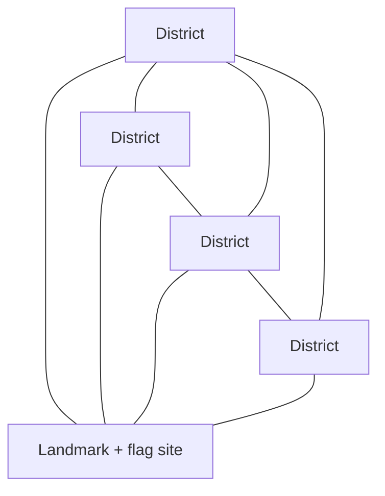
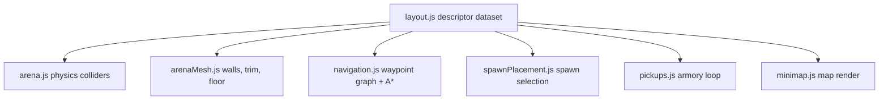

# Asymmetric Districts Arena - Plan

## Goal Capsule

- **Objective:** Replace the symmetric five-room arena with one bigger, hand-crafted asymmetric arena — structurally distinct districts around the retained central landmark room — with engagement scaled to the larger space and the machine gun as everyone's default weapon.
- **Product authority:** This Product Contract, confirmed in brainstorm dialogue. `CONCEPTS.md` carries canonical vocabulary. The surrounding areas named under How This Work Fits Together (flag objective, weapon archetypes, verticality) are not active scope.
- **Execution profile:** Six dependency-ordered units; U1 (weapon default) lands and validates on the current map before the layout swap. Human play-validation checkpoints gate U1, U2, U4, and U5 — pacing and readability cannot be verified by tests alone.
- **Stop conditions:** Stop and surface rather than guess if the new layout cannot satisfy the whole-map sightline requirement, if bot navigation needs code changes beyond data and tests, or if any change would touch the healing model (KTD7).
- **Open blockers:** None.

---

## Product Contract

### Summary

One bigger, hand-crafted asymmetric arena replaces the current symmetric five-room layout: structurally distinct districts around the central landmark room, connected by a corridor web of overlapping loops instead of one ring. Bot population and tuning scale so the engagement rhythm holds across the larger space, the machine gun becomes everyone's default weapon, and the landmark room reserves a site for the flag objective coming in the next pass.

### Problem Frame

The complaint comes straight from play: every room looks the same, and a match settles into running the one corridor ring. The current design chose this — identical room footprints told apart only by accent color and pillar landmarks, on a single loop — so the sameness is structural, not cosmetic. The baseline pistol compounds it: it kills slowly enough that fights feel flat, and the interesting gun spends most of the match sitting in one room as a pickup.

### Key Decisions

- **Hand-crafted asymmetric layout over procedural generation** — keeps the map-knowledge pillar that hunt-and-ambush pacing depends on; a generator would turn "reward knowing the map" into "reward reading maps". Governs R1, R2, R3.
- **Arena now, flag next** — each pass ships and validates alone; this arena shapes the landmark room to receive the flag objective rather than building it. Governs R5.
- **Machine gun becomes everyone's default; the pistol is retired** — symmetric lethality for player and bots, with difficulty staying on the existing tuning knobs. Governs R6, R7.
- **Engagement scales through contact-density knobs, not harder individual bots** — bigger ground with the same rhythm, consistent with how pacing has always been tuned here. Governs R8.
- **Structure carries place identity; accent color becomes the secondary cue** — districts must be distinguishable by geometry alone, unlike today's rooms. Governs R2, R9.

<!-- ce-section: work-relationships -->
### How This Work Fits Together

This plan owns the arena expansion only. The breakdown below is the current understanding of the surrounding work, not a committed roadmap; a later plan may revise, split, merge, or discard any of it.

- **Flag objective** (planned as the immediate next pass) — a flag in the landmark room that bots can dislodge, scoring by hold time.
  - Depends on this plan's reserved flag site (R5).
  - Restores the room-control prize that removing the MG pickup takes away.
  - Still to decide: everything about its scoring, bot behavior, and HUD.
- **More weapon archetypes** (parked, needs its own brainstorm) — the other half of the original "more weapons, larger map" wish.
  - Shares the pickup/respawn system this plan keeps in place (R7).
  - Benefits from the new districts' varied engagement ranges; deliberately sequenced after the map so weapons are tuned once against the final space.
- **Verticality — catwalks, ramps** (deferred, unchanged from `docs/plans/2026-08-05-001-feat-rooms-and-corridors-arena-plan.md`) — the natural later graft onto this flat layout once it settles.
  - Can proceed independently of the flag and weapons areas.

### Requirements

**Layout**

- R1. The arena grows into one hand-crafted asymmetric layout with more distinct spaces than today's five rooms, keeping the central landmark room as the fixed reference point.
- R2. Each district is identifiable at a glance by structure alone — its own spatial grammar (for example: tight chamber warren, open long-sightline yard, pillared hall, cover-block maze) — with accent color as a secondary cue.
- R3. The corridor network forms a web of overlapping loops: adjacent districts connect by more than one viable route, so no single ring circuit is the default way around the arena.
- R4. Partial information holds everywhere: no reachable position sees the whole map, long sightlines end inside their own district, every doorway is passable, and no space is a dead end.
- R5. The landmark room keeps its identity, drops the MG pickup, and reserves a designated flag site for the next pass.

The diagram shows the required topology shape — spokes plus perimeter plus cross-cuts producing many loops — not a committed district count or geometry.

**Loadout**

- R6. The machine gun is the default, infinite weapon for every entity, player and bots alike; the pistol and the MG's ammo-and-revert machinery leave the game.
- R7. The MG map pickup is removed; grenade pickups remain in outlying districts, and the pickup/respawn system stays in place for future items.

**Pacing**

- R8. Engagement frequency in the bigger arena matches or exceeds today's rhythm, scaled through contact-density knobs — bot count and ramp, awareness ranges, spawn placement, kill target — never by making individual bots harder.

**Continuity**

- R9. The whole new arena stays readable at a glance on the circular player-up minimap, with each district carrying a distinct accent identity there.
- R10. Bots navigate the entire new arena — the waypoint graph covers every district and doorway — and every match-scoped system (reset, respawn, killfeed, decals, pickups) works unchanged in the new layout.

No Key Flows section: this work is layout and tuning; it introduces no new multi-step behavior.

### Acceptance Examples

- AE1. **Covers R2.** Dropped into any district at random, the player can name where they are from geometry alone, before reading accent color or the minimap.
- AE2. **Covers R3.** When the direct connection between two adjacent districts is contested, at least one alternate route links them without crossing the whole arena.
- AE3. **Covers R6.** When any entity dies and respawns, it returns with the infinite MG — no weapon downgrade exists; the grenade pocket still survives death and empties only on match reset.
- AE4. **Covers R8.** A full match in the new arena produces at least as many player engagements per minute as today's arena at current tuning.
- AE5. **Covers R9.** At a glance mid-match, every district cell and its accent are distinguishable on the minimap, and the corridor web renders without blurring into the 160px frame.

### Success Criteria

- Consecutive matches stop settling into one circuit: route choice visibly varies run to run.
- Kills per match rise relative to today at equal match length — the MG-default change is felt, not just present.

### Scope Boundaries

- **Deferred for later:** the flag objective (next pass), new weapon archetypes (own brainstorm), verticality (grafts on after this flat layout settles).
- **Outside this work's identity:** procedural or per-match generated layouts — rejected to protect the map-knowledge pillar; a second selectable map — this work evolves the single arena in place.

### Dependencies / Assumptions

- Until the flag pass lands, room control rests on grenade pickups alone; this transitional state is accepted.
- Bots wielding the MG by default raises their lethality; rebalance happens through the existing aim-spread and reaction-delay knobs, not new mechanisms.
- The arena remains authored as the single descriptor dataset both physics and rendering consume (`src/arena/layout.js`), so the expansion is data plus tuning, not a rendering/physics rework.

### Sources / Research

- `src/arena/layout.js` — single descriptor dataset for walls, rooms, doorways, pillars, spawns, pickups, accents; `FLOOR_HALF_SIZE` is one square scalar consumed by the floor collider, ground mesh, and minimap fit (KTD1's constraint).
- `src/sim/weapon.js` — config-registry weapons; `test/sim/architecture.test.js` forbids weapon-id literals outside it, which is why KTD2 localizes the default swap.
- `src/sim/bot/navigation.js`, `src/sim/bot/fsm.js` — waypoint graph builds generically from layout data; awareness/attack ranges are commented as calibrated to the current map and flagged for retune.
- `src/sim/bot/difficulty.js`, `src/shell/botRamp.js`, `src/shell/matchEnd.js`, `src/arena/spawnPlacement.js` — the contact-density and difficulty knobs R8 scales.
- `src/ui/minimap.js` — circular player-up minimap; diagonal-fit auto-normalizes any arena size into the fixed frame.
- `docs/solutions/logic-errors/` — grenade-blast death-strip bypass, killfeed reset registration, bot obstacle-avoidance reversal, bot retreat-survives-death: the bug classes this rework stresses (see KTD7 and U3/U5 test scenarios).
- `docs/plans/2026-08-05-001-feat-rooms-and-corridors-arena-plan.md` — the prior arena plan this one supersedes spatially; source of the verticality deferral.
- `CONCEPTS.md` — Room, District, Doorway, Room Accent, Armory Loop, Hunt-and-Ambush Pacing, Match Reset.

---

## Planning Contract

Product Contract preservation: restructured, no scope change — added AE5 (covers R9); resolved the four Outstanding Questions into KTD4 and KTD6 and removed that section. All other R/AE IDs and text unchanged.

### Key Technical Decisions

- KTD1. **The outer footprint stays one bigger square.** `FLOOR_HALF_SIZE` grows but remains a single scalar computed as the bounding half-size over all spaces; districts shape the interior. A non-square footprint would force generalizing the floor collider, ground mesh, and minimap diagonal-fit for no product gain. Cites R1, R9.
- KTD2. **The machine gun becomes `DEFAULT_WEAPON_ID` with infinite fire; pistol machinery is deleted, registry seams stay.** Delete the pistol config, ammo tracking and auto-revert, the death-strip weapon reset (nothing left to strip), the HUD ammo element, and pistol art/audio/model constants. Keep the registry-shaped maps (weapon configs, viewmodel visuals, killfeed glyphs, gunshot sound sets) as minimal seams for the deferred weapon-archetypes pass — a small live map is a seam, not dead code. The killfeed glyph map keeps two entries (MG and grenade, since grenades stay in the game); the other maps drop to one. Cites R6, R7.
- KTD3. **The flag site ships as data only.** A reserved coordinate descriptor in the layout dataset, clearance-validated like pickups (clear of the central pillar and doorways); nothing renders, no minimap marker, no HUD affordance. The flag pass adds the visible objective. Cites R5.
- KTD4. **Six districts: five outlying plus the landmark, at roughly 1.5× today's linear footprint.** Four outlying grammars anchor on R2's examples (chamber warren, long-sightline yard, pillared hall, cover-block maze); the fifth is chosen during implementation. Every district is authored inside a navigability envelope: an unobstructed straight segment from each of its doorways to its nav point, with interior obstacles as free-standing convex blocks the steering slide can route around — no closed chambers or deep concave pockets; the warren and maze grammars are shaped within that envelope. One grenade pickup per outlying district. Five unique colorblind-safe non-blue accent hues (the existing four plus yellow) — five is the palette ceiling, which caps accented districts this pass. The yard's sightlines may exceed grenade throw range; that is an accepted per-district asymmetry. Cites R1, R2, R7, R9.
- KTD5. **Doorway widths stay uniform.** Doorway width and the corridor channel behind it are coupled geometry; varying widths would require per-doorway channel work with no requirement behind it. Variety comes from interiors and topology.
- KTD6. **Tuning baselines, retuned via live play:** bot roster 4 → 6 with initial active bots 2 → 3 and ramp interval 20s → 15s; kill target 10 → 15 so faster MG kills plus more bots don't shorten matches; awareness and attack ranges retuned against the new map's diagonals in play, per the calibration note in the bot FSM. Aim spread, reaction delay, grenade respawn timer, and pocket capacity stay untouched pending playtest. Cites R8.
- KTD7. **The healing model does not change.** The bot retreat-phase death fix depends on the no-gradual-heal invariant (`docs/solutions/logic-errors/bot-retreat-survives-death.md`); tuning knobs are safe, healing-model changes are out of bounds for this plan.

### High-Level Technical Design

The arena swap is a data change: every production consumer iterates the layout descriptors generically, so new districts propagate automatically. The break surface is the square floor scalar (KTD1) and the geometry-coupled tests.

The weapon change (U1) is independent of the layout change (U2 onward): the architecture test's weapon-id literal guard means consumers reference `DEFAULT_WEAPON_ID`, so swapping its value plus deleting pistol machinery localizes to the weapon module and the lookup tables that shrink to one entry.

---

## Implementation Units

### U1. Machine gun becomes the only weapon

- **Goal:** MG is the default, infinite weapon for every entity; pistol and MG-pickup machinery are gone; the game plays on the current map.
- **Requirements:** R6, R7. Covers AE3.
- **Dependencies:** None.
- **Files:** `src/sim/weapon.js`, `src/sim/world.js`, `src/sim/pickups.js`, `src/arena/layout.js` (remove the MG pickup entry), `src/ui/hud.js`, `src/ui/killfeed.js`, `src/render/weaponView.js`, `src/render/pickupMeshes.js`, `src/render/modelAssets.js`, `src/audio/gunshots.js`, `src/main.js`; tests: `test/sim/combat.test.js`, `test/sim/world.test.js`, `test/sim/pickups.test.js`, `test/sim/botAI.test.js`, `test/shell/matchEnd.test.js`, `test/arena/layout.test.js` (MG-pickup assertion), `test/ui/hud.test.js`, `test/ui/killfeed.test.js`, `test/render/weaponView.test.js`, `test/render/pickupMeshes.test.js`, `test/audio/gunshots.test.js`, `test/sim/architecture.test.js` (must still pass unchanged).
- **Approach:** per KTD2:
  1. Point `DEFAULT_WEAPON_ID` at the machine gun; delete the pistol config and the ammo/auto-revert machinery.
  2. Remove the death-strip weapon reset in the world module and the `ammo` entity field.
  3. Remove the MG pickup entry and the MG branch in pickup collection; grenade path untouched.
  4. Delete the HUD ammo element and its formatting; delete pistol viewmodel registration, pickup mesh/model entries, and gunshot sound set; collapse the killfeed glyph map to the MG and grenade entries.
- **Execution note:** Land and validate on the current map before any layout work, so lethality is judged on familiar ground.
- **Test scenarios:**
  - Every entity spawns, respawns, and match-resets holding the MG (Covers AE3).
  - Death leaves the held weapon unchanged; the grenade pocket survives death and empties on match reset (Covers AE3).
  - Held fire streams at the MG cooldown indefinitely; no revert event exists and no ammo state changes.
  - Killfeed renders the MG glyph for hitscan kills and the grenade glyph for blasts.
  - Grenade-blast kills still process through the shared kill-event pass (regression guard for the death-strip bypass class).
  - The weapon-id literal guard in the architecture test passes without modification.
  - HUD renders no ammo element in any state.
- **Verification:** `npm test` green; human checkpoint — play the current map: MG from first spawn, no pickup in the central room, kills feel faster. Record baseline engagements-per-minute and kills-per-match during this checkpoint — the comparison figures for AE4 and the kills-per-match Success Criterion.

### U2. District layout dataset

- **Goal:** The six-district asymmetric arena exists as data: districts, corridor web, spawns, grenade pickups, accents, and the reserved flag site.
- **Requirements:** R1, R2, R3, R4, R5, R7. Covers AE1, AE2.
- **Dependencies:** U1.
- **Files:** `src/arena/layout.js`; tests: `test/arena/layout.test.js`, `test/arena/arena.test.js`.
- **Approach:** per KTD1, KTD3, KTD4, KTD5:
  1. Author five outlying district descriptors plus the landmark room — axis-aligned boxes, uniform doorway widths, grammars and navigability envelope per KTD4.
  2. Author the corridor web: spokes, perimeter connections, and cross-cuts so every adjacent district pair has at least two routes (R3). Each corridor or spoke space is convex — every pair of its doorways joined by an unobstructed straight segment inside the space; bends and junctions are authored as separate spaces connected by doorway entries, following the existing spoke-junction pattern.
  3. Replace the symmetric floor formula with a computed square bounding half-size over all spaces (KTD1).
  4. Add nav-point overrides for any district whose center is inside landmark geometry (existing convention).
  5. Place two spawn points per district (twelve total), one grenade pickup per outlying district, and the flag-site descriptor — all clearance-validated.
  6. Key the accent map by the five outlying district ids (existing four hues plus yellow); landmark and corridors stay neutral.
- **Patterns to follow:** the existing wall-generation helpers and hand-placement clearance conventions in `src/arena/layout.js`; module header comment names the requirement it serves.
- **Test scenarios:**
  - Every district has at least two doorways; every doorway is wide enough for the character controller (existing invariant tests, regenerated).
  - At least one outlying district has exactly two doorways — the designated host for U3's stuck-repath exhaustion regression test.
  - Every district's straight segment from each doorway to its nav point clears all interior geometry (KTD4's navigability envelope).
  - For every non-room space, the straight segment between each pair of its doorways clears all walls.
  - Whole-map sightline check regenerated programmatically from the new layout — no position sees the whole map, and the yard's longest sightline terminates inside the yard (R4). Fixture points derived from the layout data, not hand-copied.
  - Adjacent-district route redundancy: for each doorway, an alternate path exists between the spaces it connects that does not use it (Covers AE2).
  - Pickup and flag-site clearance validation: clear of pillars and doorway openings.
  - Accent map covers exactly the five outlying ids; landmark resolves neutral.
  - Spawn points lie inside their district's footprint.
- **Verification:** `npm test` green; human checkpoint — walk the arena: each district nameable by structure alone (AE1), no visible seams or holes.

### U3. Bot navigation and steering on the new topology

- **Goal:** Bots traverse, chase, search, and retreat across all six districts with no navigation code changes beyond data and tests.
- **Requirements:** R10. Covers AE2 (bot-side route choice).
- **Dependencies:** U2.
- **Files:** `test/sim/bot/navigation.test.js`, `test/sim/botAI.test.js`; `src/sim/bot/steering.js` and layout nav-point overrides only if tests fail.
- **Approach:** the graph builds from data, so this unit is proof, not rework. Rehome the stuck-repath exhaustion regression test onto a district with exactly two doorways (guarantee one exists in U2). Add directional steering tests against the new obstacle shapes per the documented steering-reversal fix.
- **Patterns to follow:** `docs/solutions/logic-errors/bot-obstacle-avoidance-reversal.md` — assert direction, not just absence of errors.
- **Test scenarios:**
  - An A* path exists between every pair of districts; no path throws.
  - Blocking a doorway edge produces a replan around it; exhausting a two-doorway district's edges triggers the clear-and-retry fallback.
  - Steering: `dot(avoidance result, desired) > 0` for head-on and oblique approaches against warren walls and cover blocks.
  - Every district's nav point is outside solid geometry.
  - Bot chase/search across a cross-cut corridor reaches the last-seen position without wall-clipping.
- **Verification:** `npm test` green; watch bots for one ramp cycle in the dev build — no bot stuck at a doorway or wall.

### U4. Minimap and render pass for the new arena

- **Goal:** The bigger arena reads at a glance on the fixed circular frame; world rendering (walls, trim, accents, decals) is correct in every district.
- **Requirements:** R9. Covers AE5.
- **Dependencies:** U2.
- **Files:** `src/ui/minimap.js` (readability tuning only), `test/ui/minimap.test.js`; `src/render/arenaMesh.js` expected unchanged.
- **Approach:** accents and geometry flow from data. Verify the diagonal-fit against the new floor scalar; retune stroke widths and cell opacity for the denser map only if the human checkpoint says it blurs. Update test fixtures to read the live floor scalar instead of a hardcoded value.
- **Test scenarios:**
  - Minimap fixtures derive from the live layout exports (no hardcoded floor half-size).
  - Room tint resolves each outlying district's accent and neutral for landmark and corridors.
  - Render smoke: arena meshes build from the new dataset without error; trim orientation holds for the new wall set.
- **Verification:** human checkpoint — AE5 at a glance mid-match; accent colors match their world districts.

### U5. Contact-density scaling and match tuning

- **Goal:** The bigger arena keeps today's engagement rhythm or better, per R8, with the KTD6 baselines applied and retuned in play.
- **Requirements:** R8, R10. Covers AE4.
- **Dependencies:** U2 (playable arena); best after U3 and U4.
- **Files:** `src/shell/botRamp.js`, `src/sim/bot/fsm.js` (awareness/attack constants), `src/shell/matchEnd.js`, `src/main.js` (roster size); tests: `test/shell/matchEnd.test.js`, botRamp/fsm test files as they exist.
- **Approach:** apply KTD6 baselines, then retune awareness/attack in live play per the FSM's own calibration note. Audit match-reset registration for the scaled roster and the reshaped pickup set — reset registration is opt-in and silently incomplete otherwise.
- **Execution note:** Retune via live play, not computed guesses — the awareness ranges were miscalibrated once before against synthetic-only geometry.
- **Test scenarios:**
  - Ramp function yields the new initial/interval/max values at representative elapsed times.
  - Match ends at the new kill target; results and Play Again flow work.
  - Match reset returns all six bots' AI memory, every grenade pickup, and the killfeed to baseline ("does this survive Play Again?" — Covers R10).
  - Respawn under the larger roster still selects mutually-hidden spawn points.
- **Verification:** human checkpoint — AE4: engagements per minute at least the U1-recorded baseline; match length not shorter than the baseline sessions; retreat behavior unchanged (KTD7 untouched).

### U6. Vocabulary and docs

- **Goal:** `CONCEPTS.md` and `README.md` match shipped behavior — no stale spec.
- **Requirements:** supports R6, R7 traceability; repo constitution requires specs updated with the change.
- **Dependencies:** U1–U5 (describe what shipped).
- **Files:** `CONCEPTS.md` (Armory Loop, Gun Slot & Grenade Pocket, Room, District entries), `README.md` (gameplay description, controls, screenshots caption if stale).
- **Approach:** rewrite the three stale entries around the MG-default and district reality; reconcile Room with the District entry rather than leaving both claiming authority; update the README's pistol/MG-pickup description.
- **Test scenarios:** Test expectation: none — documentation-only unit.
- **Verification:** no `CONCEPTS.md` or `README.md` sentence contradicts shipped behavior.

---

## Verification Contract

| Gate | Command / method | Applies to | Done signal |
|---|---|---|---|
| Unit and integration tests | `npm test` (vitest) | every unit, before every commit | suite green, including regenerated geometry fixtures and the unchanged architecture guard |
| Build smoke | `npm run build` | U2 onward, and before final done | static build succeeds |
| Play validation: lethality | `npm run dev`, human plays current map | U1 | MG from spawn, faster kills, no central pickup |
| Play validation: arena | `npm run dev`, human walks and fights | U2, U4 | AE1 and AE5 hold; no seams, holes, or stuck bots |
| Play validation: pacing | `npm run dev`, full matches | U5 | AE4 holds; both Success Criteria observed |

Full test suite before every commit, per the repo constitution. One unit merges before the next begins.

---

## Definition of Done

- All requirements R1–R10 are satisfied and AE1–AE5 validated — AE1, AE4, and AE5 by human play, the rest by tests.
- Both Success Criteria observed across consecutive play sessions: routes vary run to run; kills per match rise at equal match length.
- `npm test` and `npm run build` green on the final state.
- No dead weapon code remains: no pistol config, ammo field, revert path, ammo HUD element, or MG-pickup branch anywhere; registry seams remain as minimal maps per KTD2 (single-entry, plus the killfeed glyph map's grenade entry).
- The flag site exists as clearance-validated data with zero rendered surface (KTD3).
- `CONCEPTS.md` and `README.md` match shipped behavior (U6).
- No abandoned-attempt or experimental code from tuning iterations remains in the diff.

## Deferred / Open Questions

### From 2026-08-07 review

- **U3 steering-edit allowance vs. the stop condition** — Implementation Unit 3 / Goal Capsule (P2, feasibility, confidence 75)

  An implementer whose steering tests fail cannot tell which instruction governs: U3 (the bot-navigation unit) plans for editing the steering module on test failure, while the Goal Capsule requires stopping and surfacing if bot navigation needs code changes beyond data and tests, and U3's own goal claims no such changes. Given the interior-heavy district shapes, a failing steering test is a likely juncture; the wrong reading either silently violates the stop condition or stalls sanctioned work.
