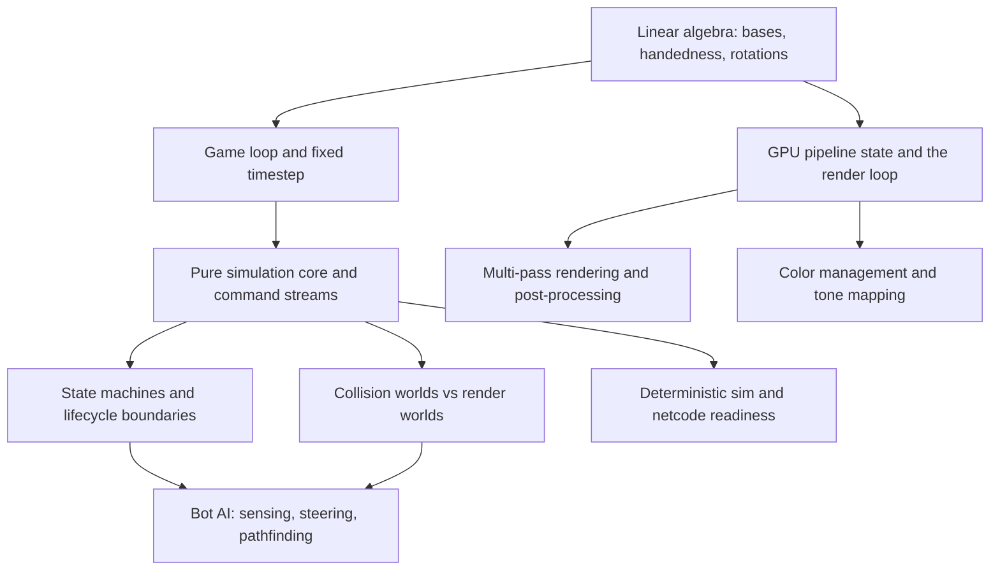

# Study Plan — Building This Project From Scratch

**Project:** FPS Arena (Three.js + Rapier browser shooter)
**Created:** 2026-08-06 (first version, from the full-project learn pass)
**Layers:** [S] structural — transfers to any platform · [O] operational — this stack · [N] nice-to-know

The ordering below is a dependency tree: each phase's topics assume the previous phase's mental models. Structural topics are prioritized because this project's ten shipped bugs all lived at structural boundaries, none in the "hard" algorithms.

## Phase 1 — Foundations (all [S])

1. **Linear algebra for 3D games** — bases, handedness, dot/cross products, rotation composition, quaternions. *The project's most-repeated bug class (3 incidents).* Exercise that breaks the naive model: derive the screen-space direction of "strafe right" given a sim that treats +Z as forward and a camera that looks down −Z — then explain why a formula can be orthonormal and still wrong. Resources: 3Blue1Brown *Essence of Linear Algebra*; *Real-Time Rendering* ch. 4.
2. **The game loop and fixed timestep** — why sim ticks at fixed dt while render interpolates; accumulator pattern; what freezes when. Exercise: explain why a timer stored as `now + duration` breaks when "now" is a per-entity clock that stops at death. Resource: Fiedler, *Fix Your Timestep*.
3. **Pure simulation cores** — ports-and-adapters applied to games; a single command shape for every controller (human, AI, network). Exercise: list everything that becomes testable headlessly once the sim never imports the renderer — then check it against this repo's `test/` tree. Resource: *Game Programming Patterns* (Nystrom) — Update Method, Command.

## Phase 2 — Simulation Patterns ([S] unless noted)

4. **State machines and lifecycle boundaries** — FSMs, and the harder half: which boundaries (death, pause, reset, disconnect) each piece of state crosses and who clears it. *Second most-repeated bug class (3 incidents).* Exercise: for every stateful system in this repo, name its reset owner; find the one that registers nothing and predict its bug. Resources: Nystrom — State; this repo's `docs/solutions/logic-errors/` (all six are worked examples).
5. **Collision world vs render world** — why physics colliders and visual meshes diverge on purpose, and what must be computed against which. Exercise: explain why decals placed from the physics raycast float in mid-air at decorative trim. Resources: *Game Engine Architecture* (Gregory), collision chapter; *Real-Time Collision Detection* (Ericson), intro chapters.
6. **Bot AI: sensing, steering, pathfinding as separate layers** — honest (LOS-gated) sensing with last-seen memory; steering as local execution; graph search as global routing; why avoidance is not navigation. Exercises: the vector-rejection slide formula, derived not copied; GameAI Pro 2 ch. 27 search-spot behavior. Resources: Millington, *AI for Games*; GameAI Pro 2 ch. 27.
7. **Event-driven wiring across producers** [O] — subscribing effects at shared emission points; one cross-producer integration test per effect. Worked example: the grenade-kill/death-strip bypass in this repo's solutions docs.
8. **Deterministic sim and netcode readiness** [N for now, S if multiplayer starts] — the Command seam is already transport-agnostic; study lockstep vs rollback vs snapshot-interpolation before opening that door. Resource: Gaffer on Games networking series.

## Phase 3 — Rendering Pipeline

9. **GPU pipeline state and the render loop** [S] — what persists across draws and passes: depth, stencil, blend, color space; how scene-graph layer systems interact with lights and shadows. *Newest bug source (2 post-build fixes).* Exercise: predict what a second render pass inherits with and without `clearDepth`, and why a light on the weapon layer stops lighting the world.
10. **Multi-pass rendering and post-processing** [S/O] — composer architecture, render targets, why MSAA dies off-screen, why the output/tone-mapping pass must be last. Resources: *WebGL Fundamentals* (framebuffers, state); three.js EffectComposer docs + this repo's `src/render/postfx.js` as the worked example.
11. **Color management and tone mapping** [O] — sRGB vs linear, texture `colorSpace`, ACES; why a texture "crushes shadow-side walls to black" when authored or tagged wrong. Resource: three.js color-management guide.
12. **Asset pipeline and sourcing** [O] — GLB loading with placeholder-first fallbacks, measured (never guessed) scale, CC0 sourcing and license records. Worked examples: `src/render/modelAssets.js`, `CREDITS.md`.

## Operational Reference [O]

- Three.js scene graph, materials, `MeshStandardMaterial` color×map semantics — three.js manual.
- Rapier character controller, ray casts (`castRay` vs `castRayAndGetNormal`) — Rapier JS docs.
- Vitest in a Node-only environment: pure-function extraction as the testability strategy (this repo's dominant test idiom).
- Audio: WebAudio positional voices, pooling, unlock gestures — `src/audio/gunshots.js`.

## Structural Patterns Proven Here (re-read before any new subsystem)

1. Descriptor datasets consumed by both physics and render (`src/arena/layout.js`) — single-source world truth.
2. Countdown-remaining timers ticked by always-running world loops — never absolute deadlines on pausable clocks.
3. Reset-hook registry: every match-scoped system exposes `resetAll()` and registers, same commit it's born.
4. Pooled effects: shared geometry, per-instance material, cap + retire-oldest — flat memory over long matches.
5. Directional (sign-asserting) tests for any basis-crossing math.
6. Fresh-context verification for any claim a plan will build on.

## Maintenance

Update this plan when a learn pass flags a topic twice, and demote topics to the reference section once an exercise has actually been done. Nothing here is homework for its own sake — each topic exists because its absence already cost a shipped bug or a plan correction.
